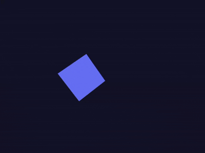

# Taller 0 - Transformaciones Básicas en Computación Visual

**Fecha:** 2025-09-12

---

## Objetivo del Taller
Explorar los conceptos fundamentales de las transformaciones geométricas (traslación, rotación y escala) y su implementación en distintos entornos de programación visual.

---

## Conceptos Aprendidos
- [x] **Transformaciones geométricas (escala, rotación, traslación)**
- [ ] Segmentación de imágenes
- [ ] Shaders y efectos visuales
- [ ] Entrenamiento de modelos IA
- [ ] Comunicación por gestos o voz
- [ ] Otro: _______________________

---

## Herramientas y Entornos
* **Python:** `matplotlib` (visualización), `numpy` (cálculo matricial), `imageio` (exportación de GIF).
* **Unity:** Versión LTS 2022.3 o superior.
* **Three.js:** A través de la librería `React Three Fiber` sobre un proyecto Vite.
* **Processing:** IDE oficial de Processing 4.
* **Entorno de Desarrollo:** Jupyter Notebook / Google Colab, VS Code.

---

## Estructura del Proyecto
El repositorio sigue la estructura definida para el taller:
```

2025-09-12_taller_0_transformaciones/
├── processing/
│   ├── output_processing/
│   │   └── ProcessingGIF.gif
│   └── ProcessingCube/
│       └── ProcessingCube.pde
├── python/
│   ├── output_python/
│   │   └── pythonGIF.gif
│   └── VisualComputing_T0_Python.ipynb
├── threejs/
│   ├── mi-escena-r3f/
│   │   └── (archivos del proyecto Vite)
│   └── output_threejs/
│       └── threejsGIF.gif
├── unity/
│   ├── unity_output/
│   │   └── unityGIF.gif
│   └── TransformController.cs
└── README.md

```
---

## Implementación
El taller se desarrolló en cuatro partes, aplicando el mismo concepto de transformaciones animadas en cada entorno para comparar sus distintas filosofías y paradigmas de programación.

### 1. Python con Matplotlib y NumPy 
* **Proceso:** Se definió una figura 2D (cuadrado) por sus vértices en coordenadas homogéneas. Se crearon funciones para generar matrices de transformación 3x3 (escala, rotación, traslación). En un bucle, se calcularon los parámetros de transformación en función de una variable de tiempo `t` y se combinaron las matrices. La matriz resultante se aplicó a los vértices originales y se renderizó el resultado con Matplotlib, guardando cada frame para luego componer el GIF.
* **Código Relevante:** La lógica principal reside en el bucle de animación, donde los parámetros de las matrices de Escala, Rotación y Traslación se calculan dinámicamente.

```python
# 't' es nuestro factor de tiempo, va de 0.0 a 1.0
t = i / (num_frames - 1)

# Calcular parámetros de transformación basados en 't'
S = get_scale_matrix(1 + 0.4 * np.sin(t * 2 * np.pi), 1 + 0.4 * np.sin(t * 2 * np.pi))
R = get_rotation_matrix(t * 360)
T = get_translation_matrix(200 * np.cos(t * 2 * np.pi), 200 * np.sin(t * 2 * np.pi))

# Combinar matrices: Escala -> Rotación -> Traslación
M = T @ R @ S

# Aplicar la transformación a los vértices originales
transformed_square = M @ original_square

```
### Resultados visuales en Python


### 2. Unity 
* **Proceso:** Se creó una escena 3D con un Cubo (`GameObject`). Se le adjuntó un script en C# que, en su método `Update()`, modifica el componente `Transform` del objeto. La rotación es constante y el escalado es oscilante. Para la traslación, el script elige un punto aleatorio y mueve el objeto suavemente hacia él usando interpolación lineal (`Vector3.Lerp`) para un efecto de movimiento continuo.
* **Código Relevante:**
   El método `Update()` contiene la lógica para la interpolación suave de la posición.

```csharp
void Update()
{
    // Rotación constante y escalado oscilante...
    
    // --- Traslación Suave usando Lerp ---
    // Incrementamos el temporizador del viaje
    journeyTimer += Time.deltaTime;

    // Calculamos el progreso del viaje (un valor de 0 a 1)
    float journeyProgress = Mathf.Clamp01(journeyTimer / movementDuration);

    // Usamos Vector3.Lerp para encontrar la posición actual en el viaje
    transform.position = Vector3.Lerp(startPosition, targetPosition, journeyProgress);

    // Si el viaje se completa, se elige un nuevo destino y se reinicia
    if (journeyProgress >= 1.0f)
    {
        startPosition = targetPosition;
        PickNewTargetPosition();
        journeyTimer = 0f;
    }
}
```
### Resultados visuales en Unity


### 3. Three.js con React Three Fiber 
* **Proceso:** Se montó un proyecto web con Vite y React. La escena 3D se construye de forma declarativa con componentes JSX (`<Canvas>`, `<mesh>`). La animación se gestiona con el hook `useFrame`, que se ejecuta en cada frame. Dentro del hook, se modifica la posición, rotación y escala del objeto a través de una referencia (`useRef`), utilizando el tiempo del reloj (`state.clock.elapsedTime`) para crear una trayectoria circular y efectos de pulso.
* **Código Relevante:**

El hook `useFrame` es el motor de la animación, actualizando las propiedades del objeto en cada renderizado.

```jsx
useFrame((state, delta) => {
    const t = state.clock.getElapsedTime();

    // 1. ROTACIÓN: Incremental en cada frame.
    meshRef.current.rotation.y += delta * 0.5;

    // 2. TRASLACIÓN: Trayectoria circular basada en el tiempo.
    meshRef.current.position.x = Math.cos(t) * 2;
    meshRef.current.position.z = Math.sin(t) * 2;

    // 3. ESCALADO: Oscilación suave basada en el tiempo.
    const scale = 1 + 0.5 * Math.sin(t * 2);
    meshRef.current.scale.set(scale, scale, scale);
});
```

### Resultados visuales en Three.js


### 4. Processing 
* **Proceso:** Se utilizó la filosofía de "lienzo dinámico" de Processing. En lugar de transformar el objeto, se transforma el sistema de coordenadas completo antes de dibujarlo. Dentro del bucle `draw()`, se usan `translate()`, `rotate()` y `scale()` para alterar el "escenario". `pushMatrix()` y `popMatrix()` aíslan estas transformaciones. La animación se basa en la variable `frameCount` para crear movimientos ondulados y cíclicos.
* **Código Relevante:**
La lógica principal ocurre dentro de la función `draw()`, donde el sistema de coordenadas se manipula secuencialmente antes de dibujar la caja.

```java
void draw() {
  // Limpiar el lienzo
  background(20, 20, 40); 
  lights();
  
  // Guardar el estado actual de coordenadas del sistema
  pushMatrix();
  
  // Translacion
  float waveX = sin(frameCount * 0.02) * 150;
  translate(width / 2 + waveX, height / 2, 0);
  
  // Rotacion
  float angle = frameCount * 0.01;
  rotateY(angle);
  rotateX(angle * 0.5);
  
  // Escalado
  float scaleFactor = 1.0 + 0.5 * sin(frameCount * 0.05);
  scale(scaleFactor);
  
  box(120);
  
  popMatrix();
}
```
### Resultados visuales en Processing


---

## Prompts Usados
Se utilizaron varios prompts basados en la guía para generar, depurar y documentar el código. El siguiente es un ejemplo utilizado para la implementación en Python:

1.  **Prompt para generar código:**
    > "Crea un script en Python usando Matplotlib y NumPy para animar una figura 2D. El script debe:
    > 1. Definir los vértices de un cuadrado.
    > 2. Aplicar transformaciones de traslación, rotación y escala usando matrices de transformación homogéneas.
    > 3. Animar las transformaciones en función de una variable de tiempo 't' para crear un ciclo completo.
    > 4. Exportar la animación final como un archivo GIF usando la librería imageio."

---

## Reflexión Final
Este taller fue muy util para conocer las diferentes herramientas que serán utilizadas a lo largo del semestre, y para entender y aplicar los conceptos aprendidos en las primeras sesiones de la clase. Cada entorno tiene sus propias caracteristicas, y con este taller se puede entender en que contextos se debe usar una herramienta u otra.

---

## Contribuciones Grupales
Este taller fue realizado de forma individual.

---

## Checklist de Entrega
- [x] Carpeta `2025-09-12_taller_0_transformaciones`
- [x] Código limpio y funcional en las 4 carpetas
- [x] GIFs incluidos con nombres descriptivos
- [x] README completo y claro
- [x] Commits descriptivos en inglés
