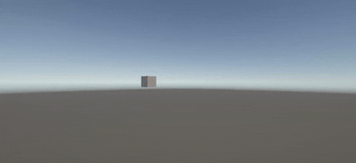

# Taller 0 - Transformaciones Básicas en Computación Visual

Este repositorio contiene las implementaciones del taller Transformaciones Básicas en Computación Visual, cuyo objetivo es explorar los conceptos fundamentales de transformaciones geométricas (traslación, rotación y escala) en cuatro entornos de programación visual diferentes. Cada implementación muestra un objeto animado en función del tiempo.

---

## 1. Python con Matplotlib y NumPy

### Explicación
Esta implementación se enfoca en el enfoque matemático de las transformaciones. Se define un cuadrado 2D a través de sus vértices en coordenadas homogéneas y se aplican transformaciones mediante la construcción y multiplicación de matrices 3x3. La animación se genera en un bucle donde, en cada frame, se calcula una matriz de transformación combinada (`M = T @ R @ S`) basada en una variable de tiempo `t`. `Matplotlib` se encarga de renderizar cada frame, y `Imageio` los une para crear el GIF final.

### Resultado


### Código Relevante
La lógica principal reside en el bucle de animación, donde los parámetros de las matrices de Escala, Rotación y Traslación se calculan dinámicamente.

```python
# 't' es nuestro factor de tiempo, va de 0.0 a 1.0
t = i / (num_frames - 1)

# Calcular parámetros de transformación basados en 't'
S = get_scale_matrix(1 + 0.4 * np.sin(t * 2 * np.pi), 1 + 0.4 * np.sin(t * 2 * np.pi))
R = get_rotation_matrix(t * 360)
T = get_translation_matrix(200 * np.cos(t * 2 * np.pi), 200 * np.sin(t * 2 * np.pi))

# Combinar matrices: Escala -> Rotación -> Traslación
M = T @ R @ S

# Aplicar la transformación a los vértices originales
transformed_square = M @ original_square

```

## 2. Unity 

### Explicación

En Unity, el enfoque es orientado a objetos. Se crea un Cubo (`GameObject`) en una escena 3D y se le adjunta un script en C\#. Las transformaciones se ejecutan en el método `Update()`. La rotación es constante y el escalado es oscilante. Para la traslación, el script elige una posición aleatoria y mueve el cubo suavemente hacia ella durante un período de tiempo definido, utilizando interpolación lineal (`Vector3.Lerp`). Una vez que llega a su destino, elige uno nuevo, creando un movimiento continuo.

### Resultado


### Código Relevante

El método `Update()` contiene la lógica para la interpolación suave de la posición.

```csharp
void Update()
{
    // Rotación constante y escalado oscilante...
    
    // --- Traslación Suave usando Lerp ---
    // Incrementamos el temporizador del viaje
    journeyTimer += Time.deltaTime;

    // Calculamos el progreso del viaje (un valor de 0 a 1)
    float journeyProgress = Mathf.Clamp01(journeyTimer / movementDuration);

    // Usamos Vector3.Lerp para encontrar la posición actual en el viaje
    transform.position = Vector3.Lerp(startPosition, targetPosition, journeyProgress);

    // Si el viaje se completa, se elige un nuevo destino y se reinicia
    if (journeyProgress >= 1.0f)
    {
        startPosition = targetPosition;
        PickNewTargetPosition();
        journeyTimer = 0f;
    }
}
```

## 3. Three.js con React Three Fiber 

### Explicación

Esta implementación utiliza un enfoque declarativo y basado en componentes para crear una escena 3D en la web. La escena se construye con JSX dentro de un componente `<Canvas>`. La animación se controla con el hook `useFrame`, que ejecuta una función en cada frame. Se utiliza un `useRef` para obtener acceso directo al objeto `mesh` y modificar sus propiedades (`position`, `rotation`, `scale`) basándose en el tiempo transcurrido del reloj (`state.clock.elapsedTime`). El componente `OrbitControls` de la librería `@react-three/drei` se añade como bonus para la navegación de la escena.

### Resultado


### Código Relevante

El hook `useFrame` es el motor de la animación, actualizando las propiedades del objeto en cada renderizado.

```jsx
useFrame((state, delta) => {
    const t = state.clock.getElapsedTime();

    // 1. ROTACIÓN: Incremental en cada frame.
    meshRef.current.rotation.y += delta * 0.5;

    // 2. TRASLACIÓN: Trayectoria circular basada en el tiempo.
    meshRef.current.position.x = Math.cos(t) * 2;
    meshRef.current.position.z = Math.sin(t) * 2;

    // 3. ESCALADO: Oscilación suave basada en el tiempo.
    const scale = 1 + 0.5 * Math.sin(t * 2);
    meshRef.current.scale.set(scale, scale, scale);
});
```
