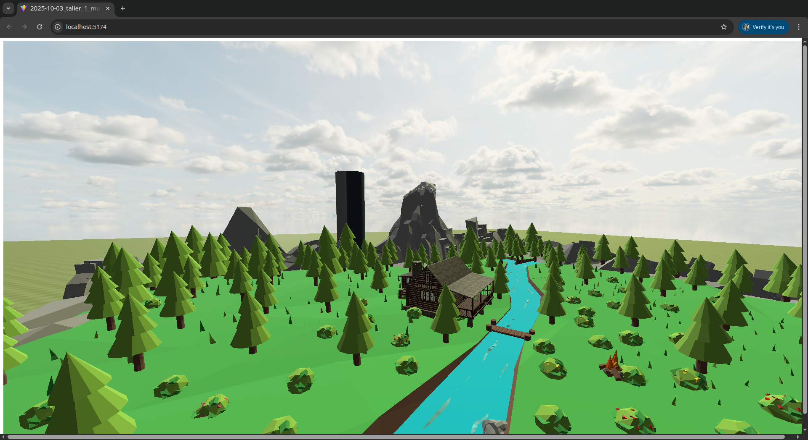

# Taller: Materiales por Iluminación y Modelos de Color en un Mundo Virtual con Three.js

## Fecha

`2025-10-03`

-----

## Objetivo del Taller

El objetivo de este taller fue diseñar y construir un mundo virtual tridimensional utilizando Three.js, con un enfoque central en la **interacción dinámica entre los materiales, la iluminación y el color**. Se buscó explorar cómo la apariencia y la atmósfera de una escena pueden ser transformadas drásticamente mediante la manipulación de luces, la aplicación de materiales PBR (Physically Based Rendering) y la generación de texturas procedurales, todo unificado bajo una paleta de colores coherente y justificada.

## Mundo Realizado
Este proyecto es una representación estilizada de un refugio sereno en la naturaleza. La escena se compone de una cabaña de madera situada en un claro del bosque, junto a una fogata crepitante y rodeada de vegetación. La escena también incluye elementos procedurales que demuestran la generación de texturas mediante código, integrándose de forma coherente con los modelos 3D y la paleta de colores definida.

### 1. Modelos GLB Usados
Se utilizaron tres modelos principales, cada uno representando una categoría distinta:

* **Modelo Arquitectónico:**
    * **Nombre:** `Log cabin.glb` (Cabaña de madera).
    * **Fuente:** Obtenido de una librería de assets 3D.
    * **Modificaciones:** El modelo fue escalado a `0.08` para ajustarse a la escala de la escena, posicionado en el centro visual y rotado `7` radianes en el eje Y para ofrecer una vista atractiva desde la cámara inicial.

* **Modelo Orgánico:**
    * **Nombre:** `Nature.glb` (Conjunto de árboles y arbustos).
    * **Fuente:** Obtenido de una librería de assets 3D.
    * **Modificaciones:** Se escaló al doble de su tamaño (`2.0`) para crear un entorno boscoso denso que enmarque la cabaña y los demás elementos.

* **Modelo Utilitario:**
    * **Nombre:** `Camp fire.glb` (Fogata).
    * **Fuente:** Obtenido de una librería de assets 3D.
    * **Modificaciones:** Se escaló a un tamaño muy reducido (`0.002`) para ajustarse a las proporciones de la escena. Se instanciaron dos fogatas para añadir más puntos de interés lumínico.

---

### 2. Iluminación
El esquema de iluminación es el corazón de este proyecto y está diseñado para ser dinámico y transformador. Se basa en un sistema de tres puntos con dos presets intercambiables.

* **Key Light (Luz Principal):** Una `DirectionalLight` que actúa como el sol. Es la principal fuente de luz y la única que proyecta sombras (`castShadow = true`) para maximizar el rendimiento. Su posición es animada para simular el paso del tiempo.
* **Fill Light (Luz de Relleno):** Una `DirectionalLight` de baja intensidad y color complementario, cuya función es suavizar las sombras y añadir un tinte de color ambiental.
* **Rim Light (Luz de Contorno):** Una `DirectionalLight` posicionada detrás de la escena para crear un contorno de luz en los objetos, ayudando a separarlos del fondo.
* **Luz Ambiental:** Una `AmbientLight` que proporciona una iluminación base global, asegurando que ninguna parte de la escena quede en oscuridad absoluta.

#### Presets de Iluminación
Se puede alternar entre dos ambientes presionando las teclas `1` y `2`:

* **Preset "Día" (Tecla 1):** Simula la luz de un día soleado. Utiliza un color de sol amarillo (`#edcf58`) y un relleno azul claro (`#71dece`). El cielo es una textura diurna brillante.
* **Preset "Atardecer" (Tecla 2):** Simula la luz cálida de una puesta de sol. El sol adquiere un tono naranja intenso (`#de9937`) y el relleno un azul acero (`#4682b4`). El cielo cambia a una textura de atardecer, sincronizándose con la iluminación.

---

### 3. Materiales y Texturas PBR
Los materiales fueron un foco central para observar la interacción con la luz.

* **Material de la Cabaña:** Se asignó un `MeshStandardMaterial` a la cabaña con una textura de tablones de madera (`dark_planks_diff_2k.jpg`) en su canal de color (`.map`). Se ajustó el `roughness` a `1.0` para darle un aspecto mate y rústico, propio de la madera sin tratar.
* **Skydome (Cielo):** Se utilizó un `MeshBasicMaterial` para el cielo, ya que no debe ser afectado por las luces de la escena. La propiedad `.side` se estableció en `THREE.BackSide` para que la textura se proyectara en el interior de una esfera gigante que envuelve el mundo. La textura del mapa (`.map`) cambia dinámicamente con los presets de iluminación.

---

### 4. Shaders Procedurales
Para cumplir con los requisitos del taller, se generaron dos texturas mediante código utilizando la API de Canvas.

* **Tipo 1: Damero (Checkerboard)**
    * **Aplicado a:** El suelo de toda la escena.
    * **Parámetros:** Se generó un patrón de 10x10 celdas con dos tonos de verde bosque (`#4a5d23`, `#3a4a13`). La textura se repite 20x20 veces sobre el plano del suelo para crear una superficie densa y estilizada.
    * **Justificación:** Se usó para crear un suelo cohesivo que no distrajera de los modelos principales y para demostrar cómo una textura generada por código puede establecer la base visual de un entorno grande.

* **Tipo 2: Bandas Verticales (Stripes)**
    * **Aplicado a:** Un cilindro (tótem procedural) colocado en la escena.
    * **Parámetros:** Se generó una textura de bandas verticales utilizando tres de los cuatro colores de la paleta principal del proyecto (`#4a5d23`, `#C5C6C7`, `#1e2a3a`).
    * **Justificación:** Este objeto actúa como una "muestra de color" viviente, demostrando la paleta cromática del mundo. Su material tiene un `metalness` de `0.7` para mostrar cómo los reflejos de la luz animada interactúan con los colores de la paleta sobre una superficie procedural.

---

### 5. Cámaras
Se configuraron dos cámaras para ofrecer perspectivas únicas del mundo virtual, alternando entre ellas con la tecla `C`.

* **Cámara en Perspectiva:** La vista principal, inmersiva y cinematográfica. Está configurada con una animación sutil, un lento paneo circular que "respira" alrededor de la escena, ideal para la grabación de video y para apreciar la profundidad y los efectos de luz en los materiales.
* **Cámara Ortográfica:** Ofrece una vista isométrica, similar a la de una maqueta o un videojuego de estrategia. Es perfecta para observar la composición espacial de la escena sin la distorsión de la perspectiva, destacando la distribución de los elementos.

---

### 6. Animaciones
Se implementaron tres tipos de animación para dar vida a la escena:

* **Animación de Luz:** La `keyLight` (sol) orbita constantemente la escena siguiendo una trayectoria circular. Esto crea un ciclo dinámico de luces y sombras que se desplazan sobre el terreno y los modelos, resaltando las texturas y los relieves.
* **Animación de Objeto:** El tótem procedural rota lentamente sobre su eje Y, permitiendo ver cómo la luz incide en sus diferentes caras y colores a lo largo del tiempo.
* **Animación de Cámara:** La cámara en perspectiva tiene un movimiento sutil y continuo, orbitando suavemente alrededor de su posición inicial. Esto evita una vista estática y añade un toque profesional al recorrido visual.

---

### 7. Modelo de Color
La paleta de colores fue cuidadosamente seleccionada para evocar una sensación de naturaleza y misterio.

* **Paleta Definida (RGB/HEX):**
    * `#1E2A3A` (Azul Noche - Color de ambiente/sombras)
    * `#4A5D23` (Verde Musgo - Color principal de la naturaleza)
    * `#C5C6C7` (Plata - Detalles y rocas)
    * `#FF6700` (Naranja Fuego - Color de acento)

* **Justificación de Contraste (CIELAB):**
    Se utilizó una base de colores análogos fríos y de baja saturación (azul y verde) para crear una atmósfera tranquila. Para asegurar que la fogata fuera el punto focal indiscutible, se eligió un **naranja brillante (`#FF6700`)** como acento. Desde la perspectiva de **CIELAB**, este color tiene una alta **luminosidad (L\*)** y un fuerte componente en el eje **a\* (rojo)**, creando un contraste perceptual máximo tanto en brillo como en cromaticidad contra el fondo azul/verde. Esto dirige la atención del espectador de forma natural hacia el punto más cálido de la escena.

-----

## Conceptos Aprendidos

Lista los principales conceptos aplicados:

  - [x] **Transformaciones geométricas (escala, rotación, traslación):** Utilizadas para posicionar, orientar y escalar todos los modelos GLB (cabaña, naturaleza, fogata) y los objetos procedurales para componer la escena.
  - [ ] Segmentación de imágenes
  - [x] **Shaders y efectos visuales:** Se aplicaron shaders a través de:
      - **Materiales PBR (`MeshStandardMaterial`):** Para simular realismo en la cabaña y otros objetos.
      - **Materiales no iluminados (`MeshBasicMaterial`):** Para el Skydome, que no debe ser afectado por las luces de la escena.
      - **Generación de texturas procedurales:** Creación de patrones de damero y bandas mediante la API de Canvas, demostrando la generación de shaders sin GLSL.
  - [ ] Entrenamiento de modelos IA
  - [ ] Comunicación por gestos o voz
  - [x] **Otro: Iluminación Dinámica y PBR:** Se implementó un sistema de iluminación de 3 puntos con presets que alteran el color e intensidad de las luces y el cielo, demostrando un entendimiento profundo del renderizado basado en la física.
  - [x] **Otro: Modelos de Color (HSV, CIELAB):** Se definió y justificó una paleta de colores usando conceptos de armonía (HSV) y contraste perceptual (CIELAB).

-----

## Herramientas y Entornos

  - Three.js / Vite.js

-----

## Estructura del Proyecto

La organización del proyecto sigue el estándar de un entorno de desarrollo con Vite y Three.js, separando el código fuente de los assets públicos y los resultados finales.

```

2025-10-03\_taller\_01\_mundo\_3d/
├── public/             
│   ├── glb\_models/      
│   └── textures/        
├── renders/             
├── threejs/            
└── README.md           

```

-----

## Implementación

El proceso de construcción de la escena se dividió en cuatro etapas principales:

### Etapas realizadas

1.  **Preparación de la Escena:** Se cargaron los tres modelos GLB principales (cabaña, naturaleza, fogata) y se ajustaron sus transformaciones para una composición coherente. Se configuró la escena base, el renderizador y las dos cámaras (perspectiva y ortográfica). Se añadió un Skydome para el fondo.

2.  **Aplicación de Algoritmos y Materiales:** Se crearon las funciones `createCheckerboardTexture` y `createStripeTexture` para generar las texturas procedurales del suelo y del tótem. Se definieron los materiales PBR para los modelos y se implementó la lógica de los presets de iluminación (`setDayPreset`, `setSunsetPreset`) que modifican dinámicamente las propiedades de las luces y el material del cielo.

3.  **Visualización e Interacción:** Se implementó el bucle de animación (`animate`) que integra los movimientos de la cámara, la luz principal y el tótem procedural. Se añadieron listeners de eventos para permitir al usuario alternar entre los presets de iluminación (teclas `1` y `2`) y las cámaras (tecla `C`).

4.  **Guardado de Resultados:** Se realizaron capturas de pantalla desde ambas cámaras y con ambos presets de iluminación. Se grabó un GIF animado que demuestra todas las funcionalidades interactivas y dinámicas de la escena.

### Código relevante

El corazón del taller reside en la capacidad de transformar el ambiente de la escena de forma instantánea. La función `setSunsetPreset` encapsula esta lógica, alterando simultáneamente múltiples fuentes de luz y la textura del cielo para crear una atmósfera completamente nueva.

```javascript
function setSunsetPreset() {
    // Cambia la luz principal a un tono naranja de atardecer
    keyLight.color.setHex(0xde9937);
    keyLight.intensity = 4.0;

    // Ajusta la luz de relleno a un azul más oscuro
    fillLight.color.setHex(0x4682b4);
    fillLight.intensity = 0.6;

    // Reduce la luz ambiental para un ambiente más oscuro
    ambientLight.intensity = 0.2;

    // Sincroniza el cielo, cambiando a la textura del atardecer
    skyMaterial.map = sunsetSkyTexture;

    console.log("Preset de Atardecer activado.");
}
```

-----

## Resultados Visuales

### Capturas de Pantalla y Video

**Vista en Perspectiva**


**Vista en Perspectiva (Preset "Día")**


**Vista en Perspectiva (Preset "Atardecer")**


**Vista Ortográfica**


**Demostración Animada**
--


-----

## Prompts Usados

Si bien no se utilizaron herramientas de IA para la generación de assets visuales finales (como texturas o modelos 3D), sí se utilizó un asistente de IA conversacional (Gemini) como herramienta de apoyo durante todo el ciclo de desarrollo.

Los prompts se enfocaron en la resolución de problemas y la explicación de conceptos. Ejemplos del tipo de consultas realizadas incluyen:

- **Conceptualización y Guía:**
  - *"¿Qué pasos debo seguir para aplicar diferentes texturas a las distintas partes de un solo modelo GLB?"*
  - *"Dame una estructura y consejos para redactar un `README.md` explicativo para este taller."*

- **Generación de Código y Boilerplate:**
  - *"Proporcióname el código inicial para un proyecto de Three.js usando Vite."*
  - *"Muéstrame una función en JavaScript que genere una textura procedural de damero usando la API de Canvas."*

- **Depuración de Errores (Debugging):**
  - *"Mi modelo 3D se renderiza completamente en negro aunque hay luces en la escena, ¿cuáles son las causas más comunes y cómo puedo solucionarlo?"*
  - *"Después de aplicar una textura, mi modelo se ve de un color sólido. ¿Qué significa y cómo puedo depurar si es un problema de UVs?"*

-----

## Reflexión Final

Este taller fue una inmersión profunda y práctica en los conceptos que separan una escena 3D estática de un mundo virtual vivo y creíble. Reforcé mi entendimiento del flujo de trabajo PBR y la importancia de cada mapa de textura. El desafío de depurar los modelos 3D con problemas de UVs, aunque complejo, me enseñó a diagnosticar problemas de geometría y a entender la importancia de un buen pipeline de assets.
La parte más interesante fue, sin duda, la implementación de los presets de iluminación. La creación de texturas procedurales también fue reveladora, mostrando una alternativa eficiente y creativa a las texturas basadas en imágenes.
En futuros proyectos aplicaré un enfoque más metódico en la selección y justificación de paletas de color desde el inicio. Además, exploraría shaders procedurales más complejos, para simular efectos naturales como el viento en los árboles o el parpadeo del fuego. Este taller me ha dado una base sólida para crear experiencias web 3D más inmersivas y artísticamente dirigidas.

-----

## Contribuciones Grupales

Taller realizado de forma individual.

-----

## Checklist de Entrega

  - [x] Carpeta `2025-10-03_taller_materiales_iluminacion_color`
  - [x] Código limpio y funcional en la carpeta `threejs/`
  - [x] GIF incluido con nombre descriptivo en la carpeta `resultados/`
  - [x] Visualizaciones o capturas exportadas en la carpeta `resultados/`
  - [x] README completo y claro
  - [x] Commits descriptivos en inglés

-----