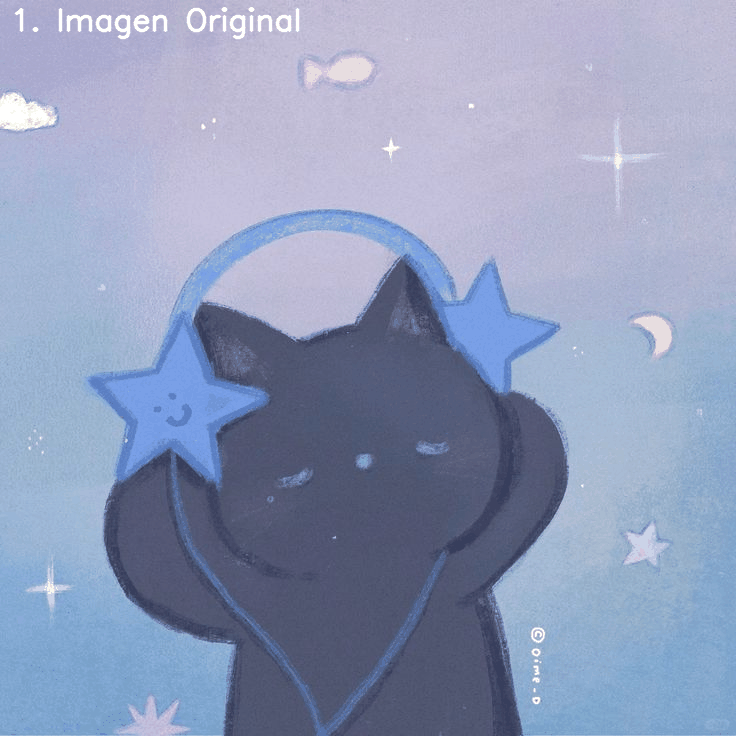
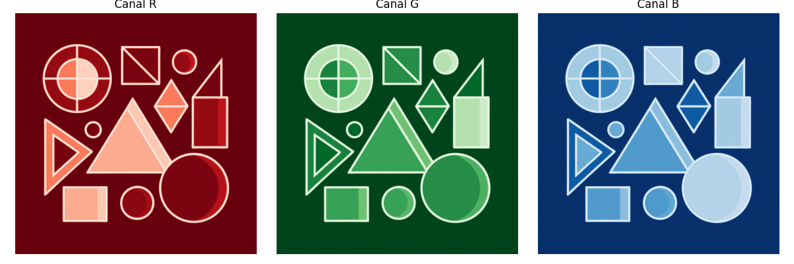
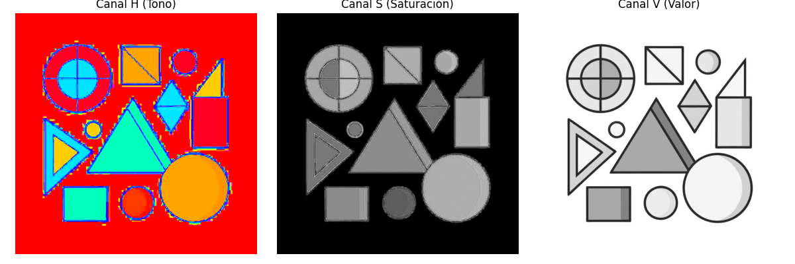
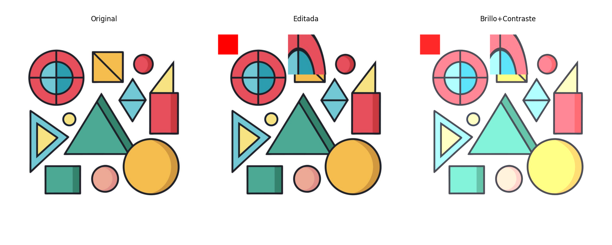
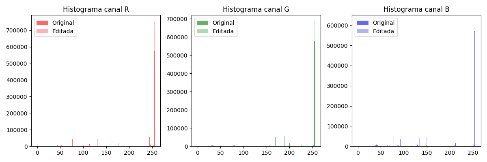
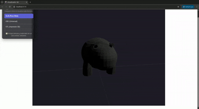
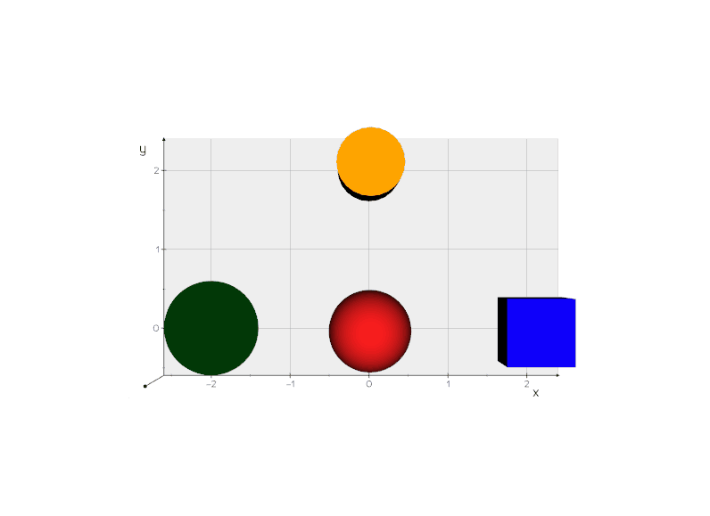
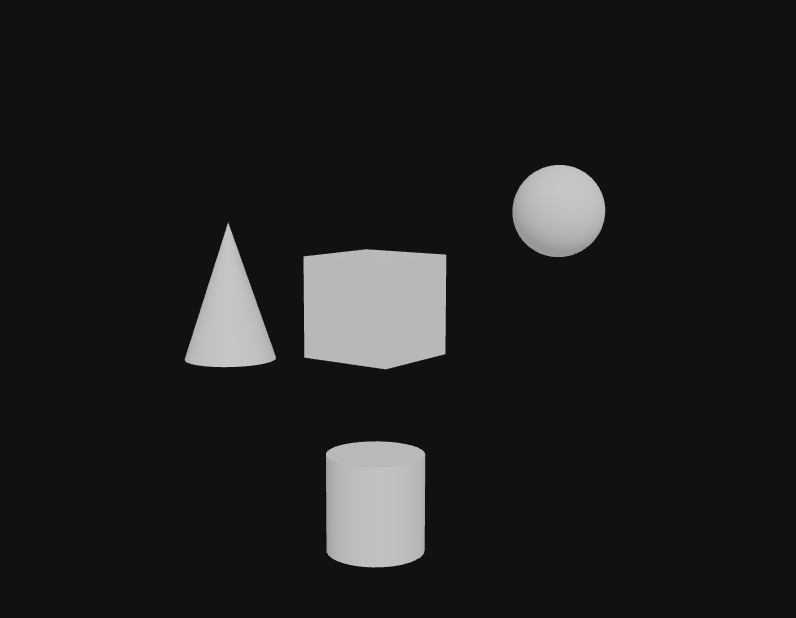
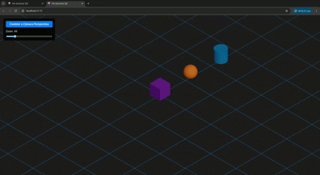

# Taller 2 — Computación Visual & 3D

## Fecha

`2025-10-15`

## Resumen del Taller

Este taller integra conceptos fundamentales de **gráficos por computador en 3D y visión artificial** en una serie de ejercicios prácticos y autocontenidos. El objetivo es explorar desde la manipulación de jerarquías y transformaciones en escenas 3D hasta el procesamiento y análisis de imágenes con técnicas de visión por computador. Cada módulo aborda un tema específico, como rasterización, proyección de cámaras, segmentación de imágenes, análisis geométrico, convoluciones personalizadas y control por gestos, permitiendo una comprensión transversal de cómo se crean y se interpretan los mundos digitales.

Los ejercicios se pueden desarrollar utilizando una combinación de **Python con OpenCV y NumPy**, **Three.js con React Three Fiber** y/o **Unity (LTS)**.

## Ejercicios Realizados

### Ejercicio 1 — Árbol del Movimiento (Jerarquías y Transformaciones)


### Ejercicio 2 — Ojos Digitales (Filtros y Bordes con OpenCV)
  - **Explicación:** Se implementó un sistema de procesamiento de imágenes que simula diferentes tipos de "visión digital" aplicando filtros y técnicas de detección de bordes. El ejercicio incluye la aplicación de filtros de suavizado (Gaussian Blur), realce (Sharpen), y detección de bordes usando operadores Sobel y Laplaciano. Cada filtro produce una representación diferente de la imagen original, mostrando cómo diferentes algoritmos pueden extraer información visual específica.
  - **Técnicas aplicadas:**
    - **Conversión a escala de grises:** Transformación del espacio de color RGB a escala de grises
    - **Filtro Gaussiano:** Suavizado de la imagen para reducir ruido
    - **Filtro de realce:** Kernel personalizado para aumentar el contraste local
    - **Operador Sobel:** Detección de bordes en direcciones X e Y
    - **Operador Laplaciano:** Detección de bordes usando la segunda derivada
  - **Código Fuente:** ejercicios/02_ojos_digitales_opencv/
  - **Comentarios Personales:** Este ejercicio fue fundamental para entender cómo diferentes filtros pueden "ver" aspectos distintos de una imagen. La comparación entre Sobel y Laplaciano mostró cómo cada método tiene sus fortalezas: Sobel es más robusto al ruido, mientras que Laplaciano detecta mejor los detalles finos. La aplicación práctica de estos conceptos en visión artificial es enorme.

### Ejercicio 3 — Segmentando el Mundo (Binarización y Contornos)
  - **Explicación:** Se implementó un pipeline en Python con OpenCV para segmentar formas geométricas. El proceso incluyó la comparación entre umbralización fija y adaptativa para binarizar la imagen, siendo la adaptativa más robusta. Posteriormente, se utilizó `findContours` para detectar cada forma, calcular sus propiedades (centroide, área, perímetro) y, como bonus, clasificarlas (triángulo, cuadrado, etc.) según el número de vértices obtenidos con `cv2.approxPolyDP`.
  - **Evidencia:** 
<div align="center">
  
</div>

  - **Código Fuente:** ejercicios/03_segmentacion_umbral_contornos
  - **Comentarios Personales:** Este ejercicio fue clave para entender la segmentación. La superioridad de la umbralización adaptativa en condiciones de luz variables fue una lección importante. La capacidad de extraer datos cuantitativos y clasificar formas a partir de contornos me pareció una herramienta de visión artificial increíblemente potente y fundamental.

### Ejercicio 4 — Imagen = Matriz (Canales, Slicing, Histogramas)
- **Objetivo :** Manipular directamente los píxeles y regiones de una imagen para comprender la representación matricial y los efectos del procesamiento básico.

- **Conceptos aplicados:**
  - Separación de canales (RGB y HSV) Se descompone la imagen en sus tres componentes de color:
    - RGB: Rojo, Verde y Azul.
    - HSV: Tono (Hue), Saturación y Valor (Brillo).
  - Edición de regiones por slicing
  - Cambio de color local
  - Histogramas de intensidades
  - Ajuste de brillo y contraste

- **Evidencia:** 
  - Separación de canales RGB:
    <div align="center">
    
    </div>
  - Separación de canales HSV:
    <div align="center">
    
    </div>
  - Comparación de versiones.
    <div align="center">
    
    </div>
  - Histogramas de intensidades
    <div align="center">
    
    </div>

### Ejercicio 5 — Rasterización desde Cero (Línea, Círculo, Triángulo)


### Ejercicio 6 — Análisis Geométrico (Centroide, Área, Perímetro)
  - **Explicación:** Se desarrolló un sistema de análisis geométrico que extrae propiedades cuantitativas de formas en imágenes. El proceso incluye binarización automática usando el método de Otsu, detección de contornos, y cálculo de métricas geométricas fundamentales como área, perímetro y centroide para cada forma detectada. Los resultados se visualizan con anotaciones superpuestas y se exportan a formato CSV para análisis posterior.
  - **Métricas calculadas:**
    - **Área:** Número de píxeles dentro del contorno usando `cv2.contourArea()`
    - **Perímetro:** Longitud del contorno usando `cv2.arcLength()`
    - **Centroide:** Centro de masa calculado mediante momentos de imagen (`cv2.moments()`)
    - **Anotaciones visuales:** Etiquetas superpuestas mostrando las métricas en tiempo real
  - **Técnicas aplicadas:**
    - **Binarización de Otsu:** Umbralización automática adaptativa
    - **Detección de contornos:** `cv2.findContours()` con modo externo
    - **Cálculo de momentos:** Para determinar propiedades geométricas
    - **Exportación de datos:** Generación de archivos CSV con métricas
  - **Código Fuente:** ejercicios/06_analisis_figuras_geometricas/
  - **Comentarios Personales:** Este ejercicio demostró la potencia del análisis cuantitativo en visión artificial. La capacidad de extraer datos precisos de formas geométricas abre posibilidades enormes para aplicaciones como control de calidad, medición automatizada y reconocimiento de patrones. La integración entre procesamiento visual y análisis de datos fue especialmente reveladora.

### Ejercicio 7 — Importando el Mundo (OBJ/STL/GLTF)
  - **Explicación:** Se desarrolló una aplicación dual para comparar los formatos 3D OBJ, STL y GLTF. Primero, un script de Python con `trimesh` se usó para analizar y convertir un modelo base a los tres formatos. Segundo, se construyó un visualizador web interactivo con Three.js y React (R3F) que permite cargar y alternar entre los modelos para observar directamente las diferencias en materiales, texturas y optimización.
  - **Evidencia:** 

<table>
  <thead>
    <tr>
      <th>Característica</th>
      <th><strong>OBJ (.obj)</strong></th>
      <th><strong>STL (.stl)</strong></th>
      <th><strong>GLTF/GLB (.glb)</strong></th>
    </tr>
  </thead>
  <tbody>
    <tr>
      <td><strong>Contenido</strong></td>
      <td>Geometría (vértices, normales, UVs), materiales externos.</td>
      <td><strong>Solo geometría</strong> de triángulos, sin color ni materiales.</td>
      <td>Escena completa: mallas, materiales PBR, texturas, animaciones.</td>
    </tr>
    <tr>
      <td><strong>Materiales</strong></td>
      <td>Sí, a través de un archivo <code>.mtl</code> separado.</td>
      <td><strong>No</strong>. Se renderiza con un color sólido por defecto.</td>
      <td><strong>Sí</strong>, soporte nativo y avanzado, todo empaquetado en un solo archivo <code>.glb</code>.</td>
    </tr>
    <tr>
      <td><strong>Uso Principal</strong></td>
      <td>Intercambio entre software de modelado (Blender, Maya).</td>
      <td><strong>Impresión 3D</strong>, prototipado rápido.</td>
      <td><strong>Web, AR/VR</strong>. Es el "JPEG del 3D", optimizado para carga rápida en tiempo real.</td>
    </tr>
    <tr>
      <td><strong>Eficiencia Web</strong></td>
      <td>Ineficiente. Múltiples peticiones (obj, mtl, texturas).</td>
      <td>Ineficiente para visualización (falta de datos visuales).</td>
      <td><strong>Altamente eficiente</strong>. Binario, comprimido y diseñado para carga rápida en la GPU.</td>
    </tr>
  </tbody>
</table>

<div align="center">
  
</div>

  - **Código Fuente:** /ejercicios/07_conversion_formatos_3d/
  - **Comentarios Personales:** Fue muy revelador ver en la práctica por qué **GLTF** es el estándar para la web: es eficiente y autocontenido. **STL** demostró su propósito para geometría pura (impresión 3D) al perder toda la información visual, mientras que **OBJ** funciona como un intermediario universal pero menos optimizado. Este ejercicio solidificó mi criterio para elegir el formato correcto según el caso de uso.

### Ejercicio 8 — Escenas Paramétricas (Objetos desde Datos)
  - **Explicación:**  Generar geometría (objetos 3D) automáticamente a partir de listas o archivos estructurados (CSV/JSON), parametrizando propiedades como posición, escala y color.
La idea es reemplazar el modelado manual por reglas y datos programables, lo que permite generar escenas flexibles y reproducibles.

- **Entornos**

  - **Python (Vedo / Trimesh)**
    - Crea primitivas (Cube, Sphere, Cone) desde datos.
    - Aplica transformaciones y exporta a `.OBJ`, `.STL` y `.GLTF`.
    - Ideal para scripting y exportación rápida.

  - **Three.js (React Three Fiber)**
    - Mapea arrays/JSON a `<mesh>` dinámicos.
    - Control de parámetros con **Leva GUI**.
    - Ideal para visualización interactiva en web.


- **Evidencia:**
    - **Python:**
      <div align="center">
      
      </div>
    - **Three.js:**
      <div align="center">
      
      </div>
    

### Ejercicio 9 — Filtro Visual (Convoluciones Personalizadas)


### Ejercicio 10 — Explorando el Color (RGB, HSV, CIE Lab + Simulaciones)
  - **Explicación:** Se desarrolló un sistema completo de análisis y manipulación de color que explora diferentes espacios de color y simula condiciones de percepción visual. El ejercicio incluye conversiones entre espacios RGB, HSV y CIE Lab, análisis de canales individuales, y simulaciones de daltonismo (protanopia y deuteranopia) además de efectos de iluminación y temperatura de color.
  - **Espacios de color explorados:**
    - **RGB:** Espacio de color aditivo basado en rojo, verde y azul
    - **HSV:** Representación basada en tono (Hue), saturación (Saturation) y valor (Value)
    - **CIE Lab:** Espacio de color perceptualmente uniforme con luminancia y coordenadas cromáticas
  - **Simulaciones implementadas:**
    - **Protanopia:** Simulación de ceguera al rojo usando matriz de transformación específica
    - **Deuteranopia:** Simulación de ceguera al verde con matriz de transformación adaptada
    - **Condiciones de baja iluminación:** Ajuste de gamma y reducción de intensidad
    - **Temperatura de color:** Modificación de canales para simular iluminación cálida
  - **Técnicas aplicadas:**
    - **Separación de canales:** Análisis individual de cada componente de color
    - **Transformaciones matriciales:** Para simular deficiencias de color
    - **Ajuste de gamma:** Para simular condiciones de iluminación
    - **Manipulación de temperatura:** Ajuste de balance de blancos
  - **Código Fuente:** ejercicios/10_modelos_color_percepcion/
  - **Comentarios Personales:** Este ejercicio fue fascinante para entender cómo percibimos el color y cómo diferentes espacios de color sirven para diferentes propósitos. Las simulaciones de daltonismo fueron especialmente impactantes, mostrando cómo una parte significativa de la población ve el mundo de manera diferente. La comprensión de estos conceptos es crucial para diseñar interfaces accesibles y aplicaciones de visión artificial robustas.


### Ejercicio 11 — Proyecciones 3D (Perspectiva vs Ortográfica)
  - **Explicación:** Se construyó una escena interactiva en Three.js para comparar las proyecciones de cámara. La aplicación permite al usuario alternar en tiempo real entre una **cámara de perspectiva**, que simula la visión humana con distorsión de profundidad, y una **cámara ortográfica**, que la elimina por completo. Una UI con sliders permite manipular los parámetros clave de cada una (FOV y Zoom) para observar su efecto en la percepción de la escala y la distancia.
  - **Evidencia:** 
  <div align="center">
  
</div>

  - **Código Fuente:** /ejercicios/11_proyecciones_camara/
  - **Comentarios Personales:** La lección más impactante fue entender que la elección de la cámara no es una decisión técnica, sino una de diseño que define por completo la percepción del usuario. Este ejercicio práctico hizo tangible la diferencia entre crear una experiencia inmersiva y cinemática (perspectiva) versus una representación técnica y precisa (ortográfica).

### Ejercicio 12 — Gestos con Webcam (MediaPipe Hands)
- **Explicación:** El objetivo del proyecto es capturar gestos de la mano mediante una cámara web y utilizarlos para interactuar con distintas escenas visuales (menú, control de color y juego).
Esto combina visión artificial, procesamiento de landmarks (puntos de referencia) y programación interactiva con Python.

- **Estructura general:** La aplicación se organiza alrededor de la clase GestureController, la cual gestiona:
  - Captura de video y detección de manos.
  - Identificación de gestos mediante landmarks.
  - Transición entre tres escenas interactivas:
    - MENU (inicio)
    - COLOR_CONTROL (control de color con gestos)
    - GAME (minijuego de objetivos)

- **Rendimiento:** Dedepende directamente de la iluminación, resolución de la cámara y potencia del CPU/GPU.
En condiciones normales (720p, 30 fps), el procesamiento de MediaPipe mantiene una latencia de 30–50 ms, suficiente para una interacción fluida.
Sin embargo, movimientos muy rápidos o iluminación deficiente pueden degradar la detección de landmarks.
La aplicación es robusta ante oclusiones parciales, pero se recomienda mantener la mano completa dentro del cuadro y con buena visibilidad.

- **Minijuego interactivo**
  - En la escena GAME:
  - El círculo verde sigue la posición de la mano (landmark índice MCP).
  - Se generan círculos azules aleatorios como objetivos.
  - Al colisionar con uno, se gana un punto y el objetivo desaparece.
  - Al completar todos, se generan nuevos automáticamente.

- **Controles de color**
  - Paz: Amarillo
  - Apuntando: Blanco
  - Puño: Magenta
  - Tres dedos: Naranja

- **Evidencia:** 
<div align="center">
  
</div>

-----

## Dependencias y Cómo Ejecutar

### Python (Ejercicios 2, 3, 4, 5, 6, 8, 9, 10, 12)

1.  **Clonar el repositorio:** `git clone https://github.com/tu_usuario/tu_repo.git`
2.  **Crear entorno virtual:** `python -m venv venv` y activarlo `source venv/bin/activate`.
3.  **Instalar dependencias:** `pip install -r requirements.txt` (debería incluir `opencv-python`, `numpy`, `matplotlib`, `mediapipe`, etc.).
4.  **Ejecutar:** `jupyter notebook` o `python nombre_del_script.py`.

### Three.js + React Three Fiber (Ejercicios 1, 7, 8, 11)

1.  **Navegar a la carpeta:** `cd ejercicios/XX_nombre_ejercicio/threejs/`
2.  **Instalar dependencias:** `npm install`
3.  **Iniciar servidor:** `npm run dev`

### Unity (Ejercicios 1, 8, 10, 11)

1.  Abrir **Unity Hub** y seleccionar **"Add project from disk"**.
2.  Navegar a la carpeta del ejercicio correspondiente (ej. `/ejercicios/01_jerarquias_transformaciones/unity/`).
3.  Abrir el proyecto, cargar la escena principal y presionar **Play**.

-----

## Estructura del Repositorio

```
yyyy-mm-dd_taller_cv_3d/
├── ejercicios/
│   ├── 01_jerarquias_transformaciones/
│   ├── 02_ojos_digitales_opencv/
│   ├── 03_segmentacion_umbral_contornos/
│   ├── 04_imagen_matriz_pixeles/
│   ├── 05_rasterizacion_clasica/
│   ├── 06_analisis_figuras_geometricas/
│   ├── 07_conversion_formatos_3d/
│   ├── 08_escenas_parametricas/
│   ├── 09_convoluciones_personalizadas/
│   ├── 10_modelos_color_percepcion/
│   ├── 11_proyecciones_camara/
│   └── 12_gestos_webcam_mediapipe/
├── assets/
├── gifs/
└── README.md
```
