# Comprehensive Visual Computing Workshop

## 1. Project Concept

This project serves as an integrated ecosystem where color, form, gesture, and sound can interact. The central goal is to articulate the full graphics pipeline—from PBR materials and custom shaders to projective mathematics—and connect it to natural human inputs.

The core experiment for points 1, 3, and 11, "The Mud Dog," explores the contrast between **low-poly** geometry and **Physically Based Rendering (PBR)**. This central object acts as a canvas, reacting dynamically to procedural generation, custom visual effects, and a suite of multimodal inputs including voice commands, real-time hand gestures, and simulated BCI signals. The objective is to create a clear, reproducible, and aesthetically grounded interactive experience.

## 2. Tools and Environment

* **Primary Engine:** Unity 2022.3.x (LTS) with Universal Render Pipeline (URP)
* **Scripting:** C# (for Unity) and Python (for multimodal input processing)
* **Libraries:**
  * **Python:** MediaPipe, SpeechRecognition, OpenCV, PyGame, NumPy, SciPy
  * **Unity:** Open Sound Control (OSC) for bridging Python and Unity
* **Shading:** Unity Shader Graph
* **Version Control:** Git / GitHub

## 3. Description of Applied Modules (A–K)

This section documents the techniques implemented for each activity in the workshop.

###  1. Materials, Light, and Color (PBR & Color Models)
* **Description:** This foundational section established the scene's base appearance.
  * **PBR Textures:** A PBR texture set (`Albedo`, `Normal Map (OpenGL)`, `Ambient Occlusion`) was applied to the low-poly dog model using the `URP/Lit` shader, allowing it to react realistically to light.
  * **Multiple Lighting:** The scene is lit using a 3-point scheme (Key, Fill, Rim) plus an HDRI skybox for global illumination and reflections.
  * **Cameras:** A C# script (`ControlCamaras.cs`) was implemented to toggle (with the 'C' key) between a `Perspective Camera` (standard 3D view) and an `Orthographic Camera` (2D view).
  * **Color Analysis (CIELAB):** A CIELAB analysis was performed, confirming a strong luminance contrast (**ΔL ≈ 28**) between the dark object (**L\* ≈ 32**) and the lighter background (**L\* ≈ 60**), ensuring scene readability.

---

### 2. Procedural Modeling from Code

---

###  3. Custom Shaders and Effects

* **Description:** Explored artistic and dynamic rendering by creating three custom shaders using Unity's Shader Graph.
    * **`ColorDinamico_Shader` (Unlit):** A dynamic shader that changes the object's color based on its **UV coordinates** (a vertical gradient) and **Time** (a pulsing sine wave).
    * **`Toon_Shader` (Unlit):** A non-photorealistic (NPR) shader that creates a cel-shaded "cartoon" look. It calculates light manually using `Dot Product` and a `Step` node to create hard bands of light and shadow.
    * **`Distortion_Shader` (Unlit):** An effect shader that creates a "mirage" or "underwater" effect. It uses animated `Simple Noise` to dynamically displace the texture's UV coordinates over time.


---

###  4. Dynamic Texturing and Particles
---

### 5. 360° Image and Video Visualization
---

### 6. Input and Interaction (UI, Input, Collisions)

---

### 7. Gestures with Webcam (MediaPipe Hands)

---

###  8. Voice Recognition and Command Control

---

###  9. Multimodal Interfaces (Voice + Gestures)
---

### 10. BCI Simulation (Synthetic EEG and Control)

---

### 11. Projective Spaces and Projection Matrices
* **Description:** This module was split into two parts: theory and practice, demonstrating how 3D is projected onto a 2D screen.
    * **Theory (Python):** Implemented orthographic and perspective projection matrices from scratch using NumPy. This demonstrated mathematically how homogeneous coordinates (specifically, dividing by the `w` component) create perspective, causing distant objects to appear smaller.
    * **Practice (Unity):** Created a "Depth Visualizer" shader (`Depth_Shader`) using Shader Graph. This `Unlit` shader uses the `Scene Depth` node to map distance (from near=black to far=white), visually demonstrating the Z-buffer.
    * **Integration:** The camera toggle script (from Point 1) was used to switch between perspective and orthographic cameras, showing how the depth visualization changes, which visually confirms the mathematical differences implemented in the Python script.

---

## 4. Key Code Snippets

### Camera Controller (Point 1)

```csharp
// File: ControlCamaras.cs
// Toggles between two cameras (perspective and orthographic) when the 'C' key is pressed.

using UnityEngine;

public class ControlCamaras : MonoBehaviour
{
    public Camera camaraPerspectiva;
    public Camera camaraOrtografica;

    void Start()
    {
        camaraPerspectiva.enabled = true;
        camaraOrtografica.enabled = false;
    }

    void Update()
    {
        // Check if the 'C' key was pressed
        if (Input.GetKeyDown(KeyCode.C))
        {
            // Invert the 'enabled' state of both cameras
            camaraPerspectiva.enabled = !camaraPerspectiva.enabled;
            camaraOrtografica.enabled = !camaraOrtografica.enabled;
        }
    }
}
````

### Custom Shaders (Point 3)
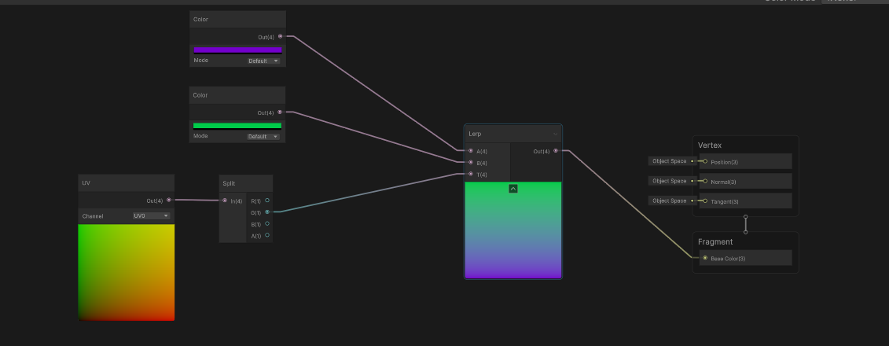
---
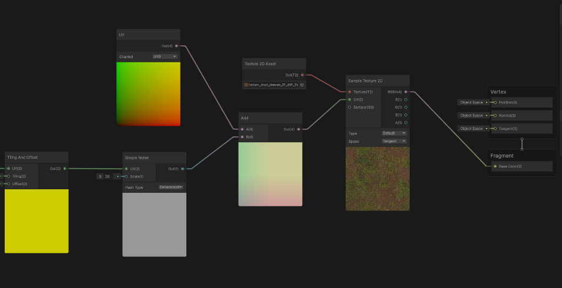
---
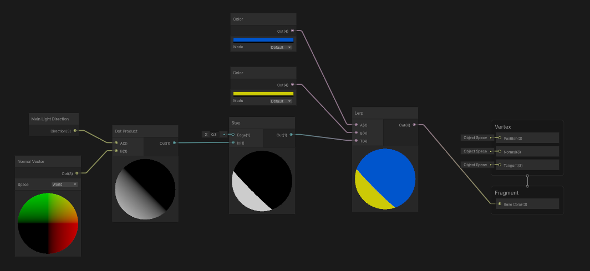

### Projection Matrices (Point 11 - Python)
```python
# File: python/projection_matrices.py
# Implements perspective projection matrix from scratch.

import numpy as np

# ... (parameter setup) ...

# Fórmula de la matriz de Perspectiva
M_persp = np.array([
    [t_calc/aspecto, 0, 0,                               0],
    [0,              t_calc, 0,                               0],
    [0,              0,      (f_persp+n_persp)/(n_persp-f_persp), (2*f_persp*n_persp)/(n_persp-f_persp)],
    [0,              0,      -1,                              0] # ¡El truco! Pone -Z en el valor W
])

# Aplicamos la matriz
p_clip_persp = M_persp @ p_mundo

# La "División de Perspectiva" es dividir (x, y, z) por 'w'.
w = p_clip_persp[3]
p_ndc_persp = p_clip_persp[:3] / w
```
### Projection Matrices (Point 11 - Unity)
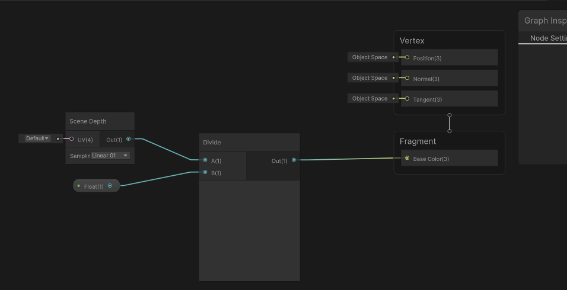
-----

## 5\. Graphic Evidence (Renders)

### PBR & Lighting (Point 1)
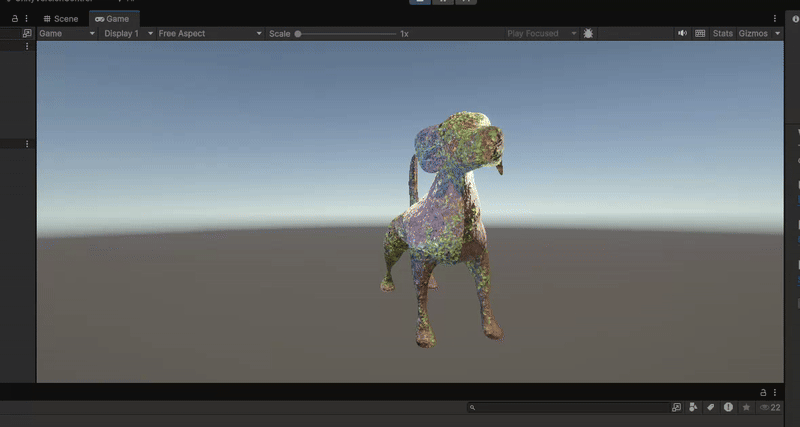

### Custom Shaders (Point 3)
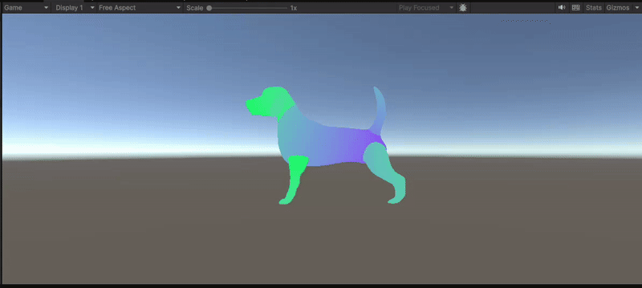
---
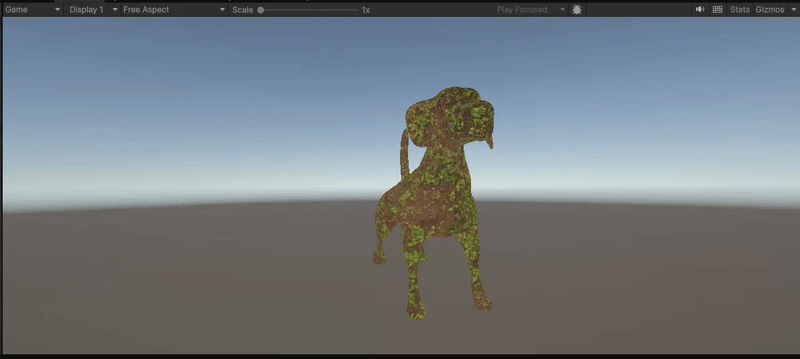
---
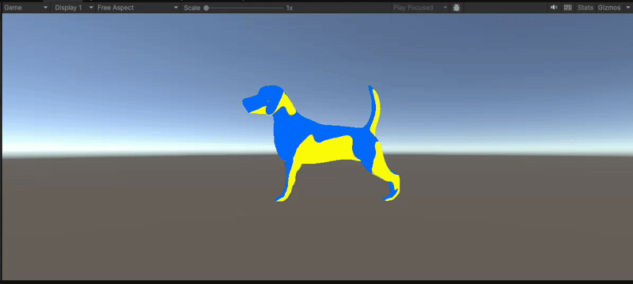

### Projection Matrices (Point 11)
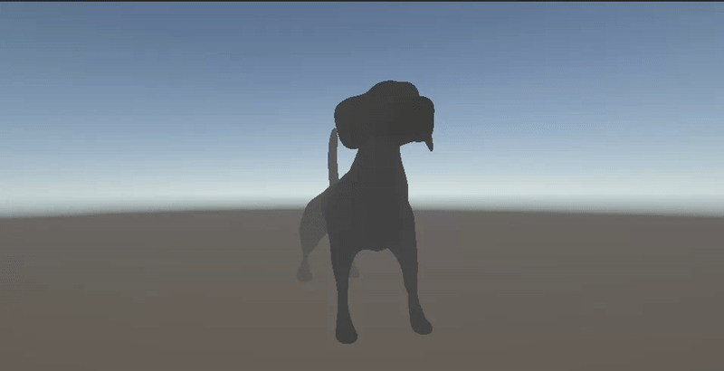

# Módulo 4: Texturizado Dinámico y Partículas

## Descripción

Implementación de materiales reactivos que cambian en tiempo real basados en shaders personalizados, junto con un sistema de partículas sincronizado. Este módulo demuestra técnicas avanzadas de texturizado procedural y animación de partículas en WebGL.

## Características

- **Material con shader personalizado**: Vertex y fragment shaders implementados en GLSL
- **Texturas dinámicas procedimentales**: Generadas usando funciones de ruido (noise)
- **Efectos visuales avanzados**:
  - Efectos de emisión y fresnel para iluminación de bordes
  - Multi-layered noise para texturas complejas
  - Vertex displacement basado en funciones de ruido
  - Color mixing dinámico entre dos colores
- **Sistema de partículas**: 1000 partículas animadas con física simple
- **Controles interactivos**: Sliders para ajustar intensidad de emisión y velocidad del ruido
- **Animación procedural**: Objeto principal (icosaedro) con rotación y desplazamiento

## Archivos Principales

- `src/main.js`: Configuración de escena, cámara, renderer y material dinámico
- `src/particles/particleSystem.js`: Sistema de partículas con física simple y actualización de colores
- `src/shaders/dynamicMaterial.vert`: Vertex shader con desplazamiento por ruido
- `src/shaders/dynamicMaterial.frag`: Fragment shader con múltiples capas de ruido

## Instrucciones de Uso

### Requisitos Previos

- Navegador web moderno con soporte para WebGL (Chrome, Firefox, Edge, Safari)
- Servidor web local (opcional, pero recomendado para evitar problemas CORS)

### Ejecución

1. Iniciar un servidor HTTP local (ver opciones en la sección general)
2. Navegar a `04_texturizado_dinamico_particulas/index.html`

### Controles

- **Emissive Intensity Slider** (0-3): Controla la intensidad del efecto de emisión
- **Noise Speed Slider** (0-3): Ajusta la velocidad de animación del ruido
- **Pause/Play Button**: Pausa o reanuda la animación
- **Reset Button**: Restablece los valores de los controles a sus valores por defecto

### Comportamiento

- El objeto icosaedro rota continuamente con efectos de textura dinámica
- Las partículas orbitan alrededor del objeto con colores que cambian en el tiempo
- Los efectos visuales responden en tiempo real a los cambios en los controles

## Código Relevante

### Fragment Shader - Multi-layered Noise

```glsl
uniform float uTime;
uniform float uNoiseSpeed;
uniform float uEmissiveIntensity;
uniform vec3 uColorA;
uniform vec3 uColorB;

varying vec2 vUv;
varying vec3 vPosition;
varying vec3 vNormal;

float noise(vec2 p) {
    return fract(sin(dot(p, vec2(12.9898, 78.233))) * 43758.5453);
}

float smoothNoise(vec2 p) {
    vec2 i = floor(p);
    vec2 f = fract(p);
    f = f * f * (3.0 - 2.0 * f);
    
    float a = noise(i);
    float b = noise(i + vec2(1.0, 0.0));
    float c = noise(i + vec2(0.0, 1.0));
    float d = noise(i + vec2(1.0, 1.0));
    
    return mix(mix(a, b, f.x), mix(c, d, f.x), f.y);
}

void main() {
    vec2 uv = vUv;
    uv += vec2(sin(uTime * 0.5), cos(uTime * 0.3)) * 0.1;
    
    // Multi-layered noise
    float n1 = smoothNoise(uv * 5.0 + uTime * uNoiseSpeed);
    float n2 = smoothNoise(uv * 10.0 - uTime * uNoiseSpeed * 0.5);
    float n3 = smoothNoise(uv * 20.0 + uTime * uNoiseSpeed * 0.25);
    
    float noiseValue = (n1 + n2 * 0.5 + n3 * 0.25) / 1.75;
    
    // Color mixing
    vec3 color = mix(uColorA, uColorB, noiseValue);
    
    // Emissive effect
    float emissive = sin(vPosition.y * 3.0 + uTime * 2.0) * 0.5 + 0.5;
    color += emissive * uEmissiveIntensity * 0.5;
    
    // Fresnel effect
    float fresnel = pow(1.0 - dot(vNormal, vec3(0.0, 0.0, 1.0)), 3.0);
    color += fresnel * uColorA * 0.3;
    
    gl_FragColor = vec4(color, 1.0);
}
```

### Vertex Shader - Displacement por Ruido

```glsl
varying vec2 vUv;
varying vec3 vPosition;
varying vec3 vNormal;
uniform float uTime;

float noise(vec3 p) {
    return fract(sin(dot(p, vec3(12.9898, 78.233, 45.543))) * 43758.5453);
}

void main() {
    vUv = uv;
    vPosition = position;
    vNormal = normal;
    
    // Vertex displacement with noise
    vec3 pos = position;
    float n = noise(position * 2.0 + uTime * 0.5);
    pos += normal * n * 0.1;
    
    gl_Position = projectionMatrix * modelViewMatrix * vec4(pos, 1.0);
}
```

## Evidencias Visuales

- : Animación del material dinámico

- [ ](./media/vidadetalla.png): Vista detallada del sistema de partículas


## Retos Técnicos

1. **Sincronización de Partículas con Shaders**:
   - Desafío: Coordinar la animación de partículas con los efectos del material dinámico
   - Solución: Sistema de tiempo unificado (`uTime` uniform) compartido entre shader y partículas

2. **Compatibilidad de Módulos ES6 con Three.js CDN**:
   - Problema: THREE.js cargado desde CDN no estaba disponible en el contexto de módulos ES6
   - Solución: Implementación de un sistema de espera asíncrona que verifica la disponibilidad de THREE antes de importar módulos

---

# Módulo 6: Entrada e Interacción (UI, Input y Colisiones)

## Descripción

Sistema completo de captura de entrada multimodal (teclado, mouse, touch) con detección de colisiones físicas y una interfaz de usuario reactiva. Este módulo demuestra cómo integrar múltiples métodos de entrada del usuario con sistemas de detección de eventos en tiempo real.

## Características

- **Input de teclado**: Sistema WASD/Arrow keys para movimiento preciso del objeto
- **Input de mouse**: Hover detection y click en objetos para interacción visual
- **Input táctil**: Soporte completo para dispositivos móviles con drag y gestos
- **Sistema de colisiones**: Detección en tiempo real entre objetos con feedback visual
- **UI Canvas**: Panel de control interactivo con color picker y sliders
- **Feedback visual**: Indicadores de estado en tiempo real mostrando inputs activos

## Archivos Principales

- `src/main.js`: Escena principal, configuración de objetos y loop de animación
- `src/input/keyboard.js`: Manejador de eventos de teclado con sistema WASD
- `src/input/mouse.js`: Manejador de eventos de mouse con raycasting
- `src/input/touch.js`: Manejador de eventos táctiles para dispositivos móviles
- `src/physics/collisions.js`: Sistema de detección de colisiones por distancia

## Instrucciones de Uso

### Requisitos Previos

- Navegador web moderno con soporte para WebGL (Chrome, Firefox, Edge, Safari)
- Servidor web local (opcional, pero recomendado para evitar problemas CORS)

### Ejecución

1. Iniciar un servidor HTTP local (ver opciones en la sección general)
2. Navegar a `06_entrada_interaccion/index.html`

### Controles

#### Teclado

- **W / ↑**: Mover objeto hacia arriba
- **S / ↓**: Mover objeto hacia abajo
- **A / ←**: Mover objeto hacia la izquierda
- **D / →**: Mover objeto hacia la derecha
- **Space**: Reset posición del objeto
- **R**: Rotar objeto manualmente

#### Mouse

- **Hover**: Pasar el mouse sobre las esferas para efectos visuales
- **Click**: Interactuar con objetos en la escena

#### Touch (Dispositivos Móviles)

- **Drag**: Arrastrar para mover el objeto principal

#### Panel de Control

- **Color Picker**: Seleccionar el color del objeto principal
- **Scale Slider**: Ajustar el tamaño del objeto (0.5x - 2.0x)
- **Reset Position Button**: Restablecer la posición del objeto

### Panel de Estado

El panel muestra información en tiempo real:
- **Mouse Position**: Coordenadas del cursor
- **Keys Pressed**: Teclas actualmente presionadas
- **Touch Status**: Estado del input táctil
- **Collision Count**: Número total de colisiones detectadas
- **Last Collision**: ID del último objeto con el que colisionó

## Código Relevante

### Sistema de Colisiones

```javascript
export class CollisionSystem {
    constructor(mainObject, objects, threshold = 1.5) {
        this.mainObject = mainObject;
        this.objects = objects;
        this.threshold = threshold;
    }
    
    check() {
        const collisions = [];
        const mainPos = this.mainObject.position;
        
        this.objects.forEach(obj => {
            const distance = mainPos.distanceTo(obj.position);
            if (distance < this.threshold) {
                collisions.push({
                    id: obj.userData.id,
                    distance: distance
                });
                // Visual feedback - cambiar color a rojo
                obj.material.color.setHex(0xff0000);
                
                // Reset color después de un tiempo
                setTimeout(() => {
                    obj.material.color.copy(obj.userData.originalColor);
                }, 200);
            }
        });
        
        return collisions;
    }
}
```

### Input de Teclado

```javascript
export class KeyboardInput {
    constructor(targetObject) {
        this.targetObject = targetObject;
        this.keys = {};
        this.speed = 0.1;
        
        this.handleKeyDown = this.handleKeyDown.bind(this);
        this.handleKeyUp = this.handleKeyUp.bind(this);
        
        window.addEventListener('keydown', this.handleKeyDown);
        window.addEventListener('keyup', this.handleKeyUp);
    }
    
    handleKeyDown(event) {
        this.keys[event.key.toLowerCase()] = true;
        this.update();
    }
    
    handleKeyUp(event) {
        this.keys[event.key.toLowerCase()] = false;
    }
    
    update() {
        if (this.keys['w'] || this.keys['arrowup']) {
            this.targetObject.position.y += this.speed;
        }
        if (this.keys['s'] || this.keys['arrowdown']) {
            this.targetObject.position.y -= this.speed;
        }
        if (this.keys['a'] || this.keys['arrowleft']) {
            this.targetObject.position.x -= this.speed;
        }
        if (this.keys['d'] || this.keys['arrowright']) {
            this.targetObject.position.x += this.speed;
        }
    }
    
    getActiveKeys() {
        return Object.keys(this.keys).filter(key => this.keys[key]).join(', ') || 'None';
    }
}
```

## Evidencias Visuales

- : Interacción con teclado
- 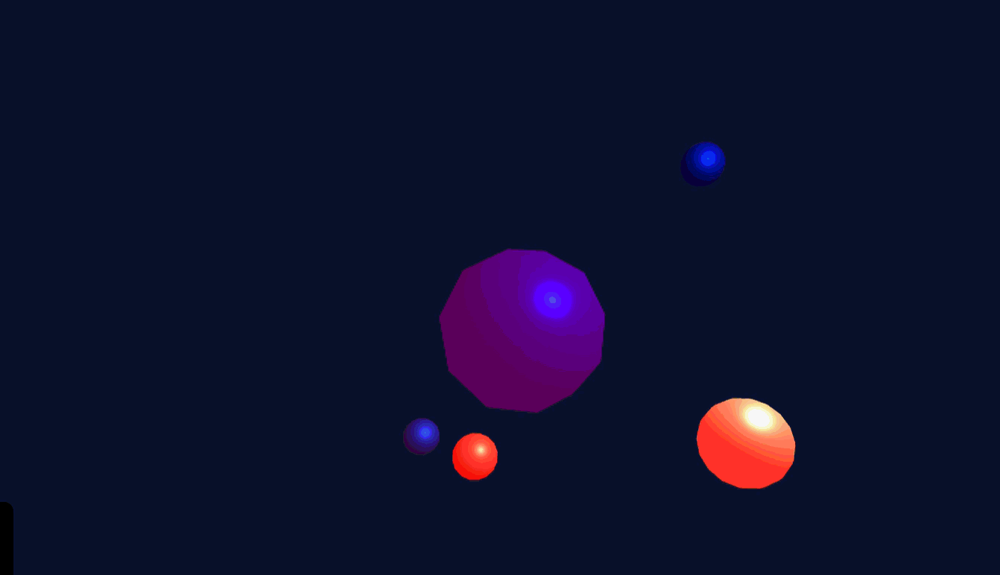:  Detección de colisiones
- 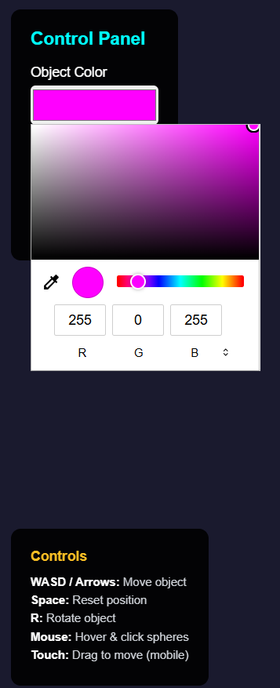: Panel de control y UI

## Retos Técnicos

1. **Detección de Colisiones en Tiempo Real**:
   - Reto: Optimizar la detección de colisiones para múltiples objetos sin afectar el rendimiento
   - Implementación: Sistema de threshold distance con actualización eficiente de geometrías

2. **Sincronización de Múltiples Inputs**:
   - Desafío: Coordinar teclado, mouse y touch simultáneamente sin conflictos
   - Solución: Sistema de eventos independiente para cada tipo de input con priorización clara

---

## Instrucciones Generales de Ejecución

### Requisitos Previos

- Navegador web moderno con soporte para WebGL (Chrome, Firefox, Edge, Safari)
- Servidor web local (opcional, pero recomendado para evitar problemas CORS)

### Opciones de Servidor HTTP

#### Opción 1: Servidor HTTP Simple (Python)
```bash
# Python 3
python -m http.server 8000

# Python 2
python -m SimpleHTTPServer 8000
```

#### Opción 2: Servidor HTTP Simple (Node.js)
```bash
npx http-server
```

#### Opción 3: Live Server (VS Code)
- Instalar extensión "Live Server"
- Click derecho en `index.html` → "Open with Live Server"

Luego acceder a `http://localhost:8000/04_texturizado_dinamico_particulas/` o `http://localhost:8000/06_entrada_interaccion/`


## 6\. Reflection

  * **Learnings:**
  * **Technical Challenges:**
  * **Possible Improvements:**


