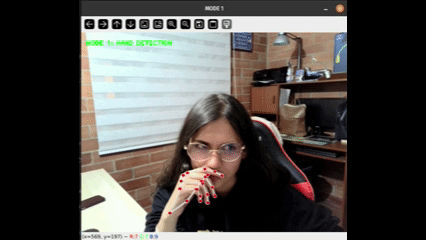
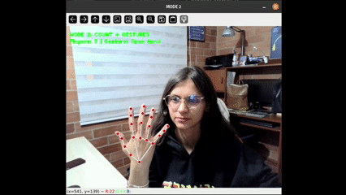
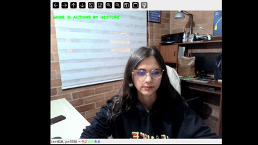
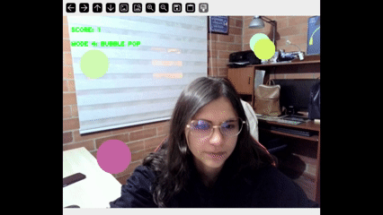
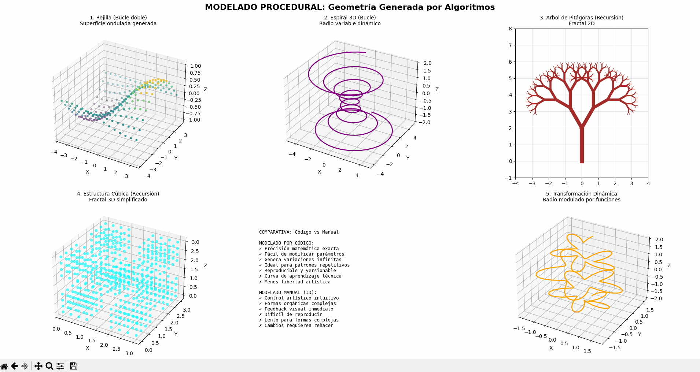
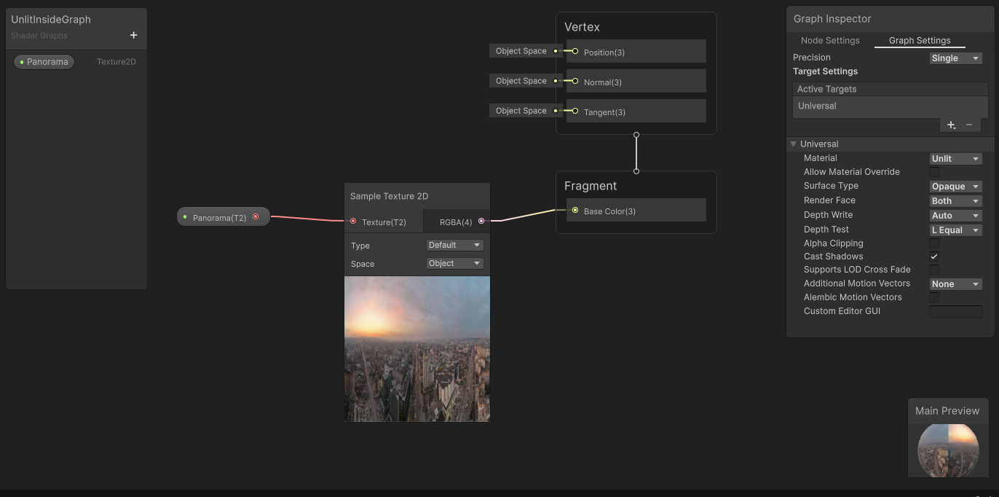
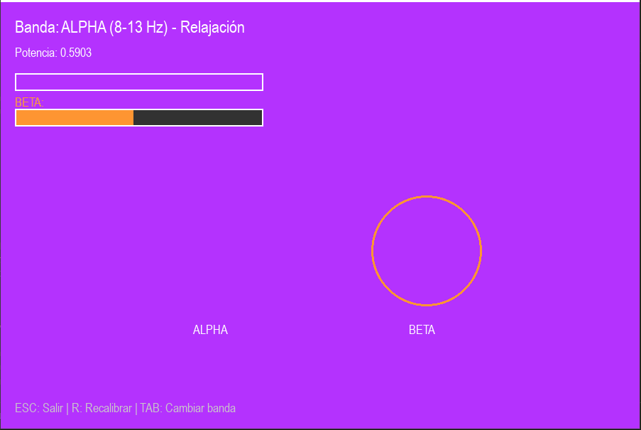

# Comprehensive Visual Computing Workshop

## 1. Project Concept

This project serves as an integrated ecosystem where color, form, gesture, and sound can interact. The central goal is to articulate the full graphics pipeline—from PBR materials and custom shaders to projective mathematics—and connect it to natural human inputs.

The core experiment for points 1, 3, and 11, "The Mud Dog," explores the contrast between **low-poly** geometry and **Physically Based Rendering (PBR)**. This central object acts as a canvas, reacting dynamically to procedural generation, custom visual effects, and a suite of multimodal inputs including voice commands, real-time hand gestures, and simulated BCI signals. The objective is to create a clear, reproducible, and aesthetically grounded interactive experience.

## 2. Tools and Environment

* **Primary Engine:** Unity 2022.3.x (LTS) with Universal Render Pipeline (URP)
* **Scripting:** C# (for Unity) and Python (for multimodal input processing)
* **Libraries:**
  * **Python:** MediaPipe, SpeechRecognition, OpenCV, PyGame, NumPy, SciPy
  * **Unity:** Open Sound Control (OSC) for bridging Python and Unity
* **Shading:** Unity Shader Graph
* **Version Control:** Git / GitHub

## 3. Description of Applied Modules (A–K)

This section documents the techniques implemented for each activity in the workshop.

###  1. Materials, Light, and Color (PBR & Color Models)
* **Description:** This foundational section established the scene's base appearance.
  * **PBR Textures:** A PBR texture set (`Albedo`, `Normal Map (OpenGL)`, `Ambient Occlusion`) was applied to the low-poly dog model using the `URP/Lit` shader, allowing it to react realistically to light.
  * **Multiple Lighting:** The scene is lit using a 3-point scheme (Key, Fill, Rim) plus an HDRI skybox for global illumination and reflections.
  * **Cameras:** A C# script (`ControlCamaras.cs`) was implemented to toggle (with the 'C' key) between a `Perspective Camera` (standard 3D view) and an `Orthographic Camera` (2D view).
  * **Color Analysis (CIELAB):** A CIELAB analysis was performed, confirming a strong luminance contrast (**ΔL ≈ 28**) between the dark object (**L\* ≈ 32**) and the lighter background (**L\* ≈ 60**), ensuring scene readability.

---

### 2. Procedural Modeling from Code

* **Description:** Explored generative geometry and algorithmic modeling by producing 3D structures entirely through code. The implementation focused on procedural form generation using **Python (NumPy, Matplotlib 3D)** to create mathematically defined shapes and spatial patterns.

* **`Spiral_Generator` (Python):** Generates 3D spiral geometries based on trigonometric functions. The radius and height evolve parametrically using sine and cosine, producing dynamic organic forms.  
* **`Grid_Pattern` (Python):** Builds procedural lattices and fractal-like surfaces using nested loops and recursive functions to explore repetition and structural growth.  
* **`Dynamic_Transformation` (Python):** Applies continuous transformations (rotation, scale, noise distortion) to vertex coordinates, showing how procedural rules can animate geometry over time.

---

###  3. Custom Shaders and Effects

* **Description:** Explored artistic and dynamic rendering by creating three custom shaders using Unity's Shader Graph.
    * **`ColorDinamico_Shader` (Unlit):** A dynamic shader that changes the object's color based on its **UV coordinates** (a vertical gradient) and **Time** (a pulsing sine wave).
    * **`Toon_Shader` (Unlit):** A non-photorealistic (NPR) shader that creates a cel-shaded "cartoon" look. It calculates light manually using `Dot Product` and a `Step` node to create hard bands of light and shadow.
    * **`Distortion_Shader` (Unlit):** An effect shader that creates a "mirage" or "underwater" effect. It uses animated `Simple Noise` to dynamically displace the texture's UV coordinates over time.


---

###  4. Dynamic Texturing and Particles

## Descripción

Implementación de materiales reactivos que cambian en tiempo real basados en shaders personalizados, junto con un sistema de partículas sincronizado. Este módulo demuestra técnicas avanzadas de texturizado procedural y animación de partículas en WebGL.

## Características

- **Material con shader personalizado**: Vertex y fragment shaders implementados en GLSL
- **Texturas dinámicas procedimentales**: Generadas usando funciones de ruido (noise)
- **Efectos visuales avanzados**:
  - Efectos de emisión y fresnel para iluminación de bordes
  - Multi-layered noise para texturas complejas
  - Vertex displacement basado en funciones de ruido
  - Color mixing dinámico entre dos colores
- **Sistema de partículas**: 1000 partículas animadas con física simple
- **Controles interactivos**: Sliders para ajustar intensidad de emisión y velocidad del ruido
- **Animación procedural**: Objeto principal (icosaedro) con rotación y desplazamiento

## Archivos Principales

- `src/main.js`: Configuración de escena, cámara, renderer y material dinámico
- `src/particles/particleSystem.js`: Sistema de partículas con física simple y actualización de colores
- `src/shaders/dynamicMaterial.vert`: Vertex shader con desplazamiento por ruido
- `src/shaders/dynamicMaterial.frag`: Fragment shader con múltiples capas de ruido

## Instrucciones de Uso

### Requisitos Previos

- Navegador web moderno con soporte para WebGL (Chrome, Firefox, Edge, Safari)
- Servidor web local (opcional, pero recomendado para evitar problemas CORS)

### Ejecución

1. Iniciar un servidor HTTP local (ver opciones en la sección general)
2. Navegar a `04_texturizado_dinamico_particulas/index.html`

### Controles

- **Emissive Intensity Slider** (0-3): Controla la intensidad del efecto de emisión
- **Noise Speed Slider** (0-3): Ajusta la velocidad de animación del ruido
- **Pause/Play Button**: Pausa o reanuda la animación
- **Reset Button**: Restablece los valores de los controles a sus valores por defecto

### Comportamiento

- El objeto icosaedro rota continuamente con efectos de textura dinámica
- Las partículas orbitan alrededor del objeto con colores que cambian en el tiempo
- Los efectos visuales responden en tiempo real a los cambios en los controles

## Código Relevante

### Fragment Shader - Multi-layered Noise

```glsl
uniform float uTime;
uniform float uNoiseSpeed;
uniform float uEmissiveIntensity;
uniform vec3 uColorA;
uniform vec3 uColorB;

varying vec2 vUv;
varying vec3 vPosition;
varying vec3 vNormal;

float noise(vec2 p) {
    return fract(sin(dot(p, vec2(12.9898, 78.233))) * 43758.5453);
}

float smoothNoise(vec2 p) {
    vec2 i = floor(p);
    vec2 f = fract(p);
    f = f * f * (3.0 - 2.0 * f);
    
    float a = noise(i);
    float b = noise(i + vec2(1.0, 0.0));
    float c = noise(i + vec2(0.0, 1.0));
    float d = noise(i + vec2(1.0, 1.0));
    
    return mix(mix(a, b, f.x), mix(c, d, f.x), f.y);
}

void main() {
    vec2 uv = vUv;
    uv += vec2(sin(uTime * 0.5), cos(uTime * 0.3)) * 0.1;
    
    // Multi-layered noise
    float n1 = smoothNoise(uv * 5.0 + uTime * uNoiseSpeed);
    float n2 = smoothNoise(uv * 10.0 - uTime * uNoiseSpeed * 0.5);
    float n3 = smoothNoise(uv * 20.0 + uTime * uNoiseSpeed * 0.25);
    
    float noiseValue = (n1 + n2 * 0.5 + n3 * 0.25) / 1.75;
    
    // Color mixing
    vec3 color = mix(uColorA, uColorB, noiseValue);
    
    // Emissive effect
    float emissive = sin(vPosition.y * 3.0 + uTime * 2.0) * 0.5 + 0.5;
    color += emissive * uEmissiveIntensity * 0.5;
    
    // Fresnel effect
    float fresnel = pow(1.0 - dot(vNormal, vec3(0.0, 0.0, 1.0)), 3.0);
    color += fresnel * uColorA * 0.3;
    
    gl_FragColor = vec4(color, 1.0);
}
```

### Vertex Shader - Displacement por Ruido

```glsl
varying vec2 vUv;
varying vec3 vPosition;
varying vec3 vNormal;
uniform float uTime;

float noise(vec3 p) {
    return fract(sin(dot(p, vec3(12.9898, 78.233, 45.543))) * 43758.5453);
}

void main() {
    vUv = uv;
    vPosition = position;
    vNormal = normal;
    
    // Vertex displacement with noise
    vec3 pos = position;
    float n = noise(position * 2.0 + uTime * 0.5);
    pos += normal * n * 0.1;
    
    gl_Position = projectionMatrix * modelViewMatrix * vec4(pos, 1.0);
}
```

## Evidencias Visuales

- : Animación del material dinámico

- [ ](./media/vidadetalla.png): Vista detallada del sistema de partículas


## Retos Técnicos

1. **Sincronización de Partículas con Shaders**:
   - Desafío: Coordinar la animación de partículas con los efectos del material dinámico
   - Solución: Sistema de tiempo unificado (`uTime` uniform) compartido entre shader y partículas

2. **Compatibilidad de Módulos ES6 con Three.js CDN**:
   - Problema: THREE.js cargado desde CDN no estaba disponible en el contexto de módulos ES6
   - Solución: Implementación de un sistema de espera asíncrona que verifica la disponibilidad de THREE antes de importar módulos

---


### 5. 360° Image and Video Visualization

* **Description:** Developed an immersive 360° environment in **Unity 3D** using panoramic media as dynamic textures. The goal was to simulate spatial exploration and real-time scene switching using equirectangular projections and custom camera controls.

* **`SkySphere_360` (Unity):** Implemented an inverted sphere mesh to display 360° equirectangular images mapped as unlit textures, ensuring seamless panoramic projection.  
* **`VideoPlayer_360` (Unity):** Integrated Unity’s `VideoPlayer` component to render spherical 360° video content on the sky dome, enabling dynamic, animated backgrounds.  
* **`OrbitCamera_Controller` (C#):** Created a custom script allowing the user to freely rotate the view using mouse input (and optionally gyroscope), enhancing immersion and exploration.

---

### 6. Input and Interaction (UI, Input, Collisions)

## Descripción

Sistema completo de captura de entrada multimodal (teclado, mouse, touch) con detección de colisiones físicas y una interfaz de usuario reactiva. Este módulo demuestra cómo integrar múltiples métodos de entrada del usuario con sistemas de detección de eventos en tiempo real.

## Características

- **Input de teclado**: Sistema WASD/Arrow keys para movimiento preciso del objeto
- **Input de mouse**: Hover detection y click en objetos para interacción visual
- **Input táctil**: Soporte completo para dispositivos móviles con drag y gestos
- **Sistema de colisiones**: Detección en tiempo real entre objetos con feedback visual
- **UI Canvas**: Panel de control interactivo con color picker y sliders
- **Feedback visual**: Indicadores de estado en tiempo real mostrando inputs activos

## Archivos Principales

- `src/main.js`: Escena principal, configuración de objetos y loop de animación
- `src/input/keyboard.js`: Manejador de eventos de teclado con sistema WASD
- `src/input/mouse.js`: Manejador de eventos de mouse con raycasting
- `src/input/touch.js`: Manejador de eventos táctiles para dispositivos móviles
- `src/physics/collisions.js`: Sistema de detección de colisiones por distancia

## Instrucciones de Uso

### Requisitos Previos

- Navegador web moderno con soporte para WebGL (Chrome, Firefox, Edge, Safari)
- Servidor web local (opcional, pero recomendado para evitar problemas CORS)

### Ejecución

1. Iniciar un servidor HTTP local (ver opciones en la sección general)
2. Navegar a `06_entrada_interaccion/index.html`

### Controles

#### Teclado

- **W / ↑**: Mover objeto hacia arriba
- **S / ↓**: Mover objeto hacia abajo
- **A / ←**: Mover objeto hacia la izquierda
- **D / →**: Mover objeto hacia la derecha
- **Space**: Reset posición del objeto
- **R**: Rotar objeto manualmente

#### Mouse

- **Hover**: Pasar el mouse sobre las esferas para efectos visuales
- **Click**: Interactuar con objetos en la escena

#### Touch (Dispositivos Móviles)

- **Drag**: Arrastrar para mover el objeto principal

#### Panel de Control

- **Color Picker**: Seleccionar el color del objeto principal
- **Scale Slider**: Ajustar el tamaño del objeto (0.5x - 2.0x)
- **Reset Position Button**: Restablecer la posición del objeto

### Panel de Estado

El panel muestra información en tiempo real:
- **Mouse Position**: Coordenadas del cursor
- **Keys Pressed**: Teclas actualmente presionadas
- **Touch Status**: Estado del input táctil
- **Collision Count**: Número total de colisiones detectadas
- **Last Collision**: ID del último objeto con el que colisionó

## Código Relevante

### Sistema de Colisiones

```javascript
export class CollisionSystem {
    constructor(mainObject, objects, threshold = 1.5) {
        this.mainObject = mainObject;
        this.objects = objects;
        this.threshold = threshold;
    }
    
    check() {
        const collisions = [];
        const mainPos = this.mainObject.position;
        
        this.objects.forEach(obj => {
            const distance = mainPos.distanceTo(obj.position);
            if (distance < this.threshold) {
                collisions.push({
                    id: obj.userData.id,
                    distance: distance
                });
                // Visual feedback - cambiar color a rojo
                obj.material.color.setHex(0xff0000);
                
                // Reset color después de un tiempo
                setTimeout(() => {
                    obj.material.color.copy(obj.userData.originalColor);
                }, 200);
            }
        });
        
        return collisions;
    }
}
```

### Input de Teclado

```javascript
export class KeyboardInput {
    constructor(targetObject) {
        this.targetObject = targetObject;
        this.keys = {};
        this.speed = 0.1;
        
        this.handleKeyDown = this.handleKeyDown.bind(this);
        this.handleKeyUp = this.handleKeyUp.bind(this);
        
        window.addEventListener('keydown', this.handleKeyDown);
        window.addEventListener('keyup', this.handleKeyUp);
    }
    
    handleKeyDown(event) {
        this.keys[event.key.toLowerCase()] = true;
        this.update();
    }
    
    handleKeyUp(event) {
        this.keys[event.key.toLowerCase()] = false;
    }
    
    update() {
        if (this.keys['w'] || this.keys['arrowup']) {
            this.targetObject.position.y += this.speed;
        }
        if (this.keys['s'] || this.keys['arrowdown']) {
            this.targetObject.position.y -= this.speed;
        }
        if (this.keys['a'] || this.keys['arrowleft']) {
            this.targetObject.position.x -= this.speed;
        }
        if (this.keys['d'] || this.keys['arrowright']) {
            this.targetObject.position.x += this.speed;
        }
    }
    
    getActiveKeys() {
        return Object.keys(this.keys).filter(key => this.keys[key]).join(', ') || 'None';
    }
}
```

## Evidencias Visuales

- : Interacción con teclado
- :  Detección de colisiones
- : Panel de control y UI

## Retos Técnicos

1. **Detección de Colisiones en Tiempo Real**:
   - Reto: Optimizar la detección de colisiones para múltiples objetos sin afectar el rendimiento
   - Implementación: Sistema de threshold distance con actualización eficiente de geometrías

2. **Sincronización de Múltiples Inputs**:
   - Desafío: Coordinar teclado, mouse y touch simultáneamente sin conflictos
   - Solución: Sistema de eventos independiente para cada tipo de input con priorización clara

---

## Instrucciones Generales de Ejecución

### Requisitos Previos

- Navegador web moderno con soporte para WebGL (Chrome, Firefox, Edge, Safari)
- Servidor web local (opcional, pero recomendado para evitar problemas CORS)

### Opciones de Servidor HTTP

#### Opción 1: Servidor HTTP Simple (Python)
```bash
# Python 3
python -m http.server 8000

# Python 2
python -m SimpleHTTPServer 8000
```

#### Opción 2: Servidor HTTP Simple (Node.js)
```bash
npx http-server
```

#### Opción 3: Live Server (VS Code)
- Instalar extensión "Live Server"
- Click derecho en `index.html` → "Open with Live Server"

Luego acceder a `http://localhost:8000/04_texturizado_dinamico_particulas/` o `http://localhost:8000/06_entrada_interaccion/`


---

### Exercise 7 — Webcam Gestures (MediaPipe + OpenCV)

**Summary:** Four operating modes:
- **Mode 1:** Hand detection and rendering
- **Mode 2:** Finger counting and basic gesture recognition
- **Mode 3:** Gesture-triggered actions (zoom, confetti, tracking)
- **Mode 4:** *Bubble Pop* game controlled by pinch gestures

#### Structure

MediaPipe Hands and OpenCV capture webcam input. Each mode is a separate function with a menu for selection. Keypoints (landmarks) infer finger positions and spatial relationships for gesture detection.

#### Key Functions

**MediaPipe Setup**
```python
mp_hands = mp.solutions.hands
mp_draw = mp.solutions.drawing_utils
FINGER_TIPS = [4, 8, 12, 16, 20]
```

**Coordinate Conversion**
```python
def landmark_to_pixel(lm, w, h): 
    return int(lm.x * w), int(lm.y * h)

def euclidean(a, b): 
    return np.hypot(a[0] - b[0], a[1] - b[1])
```
*MediaPipe returns normalized coordinates (0..1); these functions convert to pixels and calculate distances for pinch detection.*

**Finger Detection**
```python
def fingers_up(hand):
    lm = hand.landmark
    up = [False] * 5
    for i, tp in enumerate([8, 12, 16, 20], start=1): 
        up[i] = (lm[tp].y < lm[tp - 2].y)
    up[0] = lm[4].x < lm[2].x
    return up
```
*Compares Y coordinates (smaller y = finger up). Thumb uses X comparison due to orientation.*

**Mode 1 — Detection**
```python
def mode_1():
    cap = cv2.VideoCapture(0)
    hands = mp_hands.Hands()
    while True:
        r, frame = cap.read()
        frame = cv2.flip(frame, 1)
        res = hands.process(cv2.cvtColor(frame, cv2.COLOR_BGR2RGB))
        if res.multi_hand_landmarks:
            for hand in res.multi_hand_landmarks:
                mp_draw.draw_landmarks(frame, hand, mp_hands.HAND_CONNECTIONS)
        cv2.imshow("MODE 1", frame)
        if cv2.waitKey(1) & 0xFF == 27: break
```

**Mode 2 — Gesture Labels**
```python
up = fingers_up(hand)
count = sum(up)
if count == 0: g = "Fist"
elif count == 5: g = "Open Hand"
elif up[1] and up[2] and not up[3]: g = "Peace"
elif up[0] and not any(up[1:]): g = "Thumb Up"
```

**Mode 3 — Visual Effects**
```python
if count == 0:  # Zoom on fist
    zoom = min(zoom + 0.02, 1.8)
    nh, nw = int(h / zoom), int(w / zoom)
    cropped = frame[(h - nh) // 2:(h + nh) // 2, (w - nw) // 2:(w + nw) // 2]
    frame = cv2.resize(cropped, (w, h))
elif up[0] and not any(up[1:]):  # Confetti on thumb up
    for _ in range(8):
        confetti.append([random.randint(0, w), random.randint(0, h), 
                        random.randint(5, 12), (random.randint(0, 255), 
                        random.randint(0, 255), random.randint(0, 255))])
```

**Mode 4 — Bubble Pop Game**
```python
ix, iy = landmark_to_pixel(lm[8], w2, h2)
px, py = landmark_to_pixel(lm[4], w2, h2)
dist = euclidean((ix, iy), (px, py))
PINCH_THRESHOLD = 35
if dist < PINCH_THRESHOLD:
    for b in bubbles[:]:
        if euclidean((ix, iy), (b.x, b.y)) < b.r:
            score += 1
            bubbles.remove(b)
            bubbles.append(Bubble(w2, h2))
```
*Detects pinch when fingertips are close; pops bubble if fingertip overlaps.*


#### Evidences

- : Hands detection

- : Finger count and gestures

- : Actions-based gestures

- : Mini game popping bubles with gestures


---

### Exercise 8 — Voice Commands (Python + VOSK + OSC → Processing)

**Summary:** Captures audio with `sounddevice`, recognizes commands with VOSK, sends OSC messages to Processing for visual control (circle movement, background color). Uses `pyttsx3` for voice feedback.

#### Architecture
- **Python:** Audio capture → VOSK recognition → OSC messaging
- **Processing:** Receives OSC on port 9000 → applies visual changes

### Python Implementation

**Initialization**
```python
MODEL_PATH = "model-es"
client = SimpleUDPClient("127.0.0.1", 9000)
model = Model(MODEL_PATH)
recognizer = KaldiRecognizer(model, 16000)
engine = pyttsx3.init()
```

**Command Mapping**
```python
COMMANDS = {
    "arriba":     ("/move", [0, 1]),
    "abajo":      ("/move", [0, -1]),
    "izquierda":  ("/move", [-1, 0]),
    "derecha":    ("/move", [1, 0]),
    "rojo":       ("/color", [1, 0, 0]),
    "verde":      ("/color", [0, 1, 0]),
    "azul":       ("/color", [0, 0, 1]),
}
```

**Command Execution**
```python
def execute_command(text):
    text = text.lower()
    for key in COMMANDS:
        if key in text:
            path, values = COMMANDS[key]
            client.send_message(path, values)
            engine.say(f"Executing command {key}")
            engine.runAndWait()
            return
    engine.say("Command not found. Please repeat")
    engine.runAndWait()
```

**Audio Callback**
```python
def callback(indata, frames, time_data, status):
    data = bytes(indata)
    if recognizer.AcceptWaveform(data):
        result = json.loads(recognizer.Result())
        texto = result.get("text", "")
        if texto.strip():
            execute_command(texto)
```

#### Processing Implementation

**Setup**
```java
OscP5 osc;
NetAddress remote;

void setup() {
  size(600, 600);
  osc = new OscP5(this, 9000);
  remote = new NetAddress("127.0.0.1", 9000);
}
```

**Message Handling**
```java
void oscEvent(OscMessage m) {
  if (m.checkAddrPattern("/move")) {
    int dx = m.get(0).intValue();
    int dy = m.get(1).intValue();
    x += dx * 20;
    y -= dy * 20;
  }
  if (m.checkAddrPattern("/color")) {
    float r = m.get(0).intValue();
    float g = m.get(1).intValue();
    float b = m.get(2).intValue();
    bg = color(r, g, b);
  }
}
```
*OSC values translate to position/color changes with scaling for visibility.*

#### Evidences
-Please see the video to view actions based on voice commands:

[Watch Video](./media/8_audio_actions.mp4)
---

### Exercise 9 — Multimodal Interface (Voice + Gestures)

**Summary:** Simultaneous audio and video processing using threads. MediaPipe detects gestures, VOSK recognizes voice commands. Combined inputs trigger compound effects.

#### Architecture

- **Audio queue** (`queue.Queue`) passes data from callback to voice thread
- **Threads:**
  - `voice_thread`: processes audio, updates state variables
  - `video_thread`: captures frames, detects gestures, renders effects
- **Shared globals:** control effects (`gesture_detected`, `confetti_active`)

#### Implementation

**Setup**
```python
vosk_model_path = "model-es"
model = Model(vosk_model_path)
recognizer = KaldiRecognizer(model, 16000)
audio_queue = queue.Queue()
```

**Audio Callback**
```python
def audio_callback(indata, frames, time, status):
    audio_data = (indata * 32767).astype(np.int16)
    audio_queue.put(audio_data.tobytes())
```

**Voice Thread**
```python
def voice_thread():
    global current_command, confetti_active, stop_display_counter
    while True:
        data = audio_queue.get()
        if recognizer.AcceptWaveform(data):
            result = json.loads(recognizer.Result())
            text = result.get("text", "")
        else:
            partial = json.loads(recognizer.PartialResult())
            text = partial.get("partial", "")
        if "fiesta" in text.lower():
            current_command = "fiesta"
            confetti_active = True
        elif "apagar" in text.lower():
            current_command = "parar"
            confetti_active = False
            stop_display_counter = 30
```

**Video Thread**
```python
def video_thread():
    global gesture_detected
    while True:
        ret, frame = cap.read()
        frame_rgb = cv2.cvtColor(frame, cv2.COLOR_BGR2RGB)
        result = hands.process(frame_rgb)
        gesture_detected = None
        if result.multi_hand_landmarks:
            for hand_landmarks in result.multi_hand_landmarks:
                mp_draw.draw_landmarks(frame, hand_landmarks, mp_hands.HAND_CONNECTIONS)
                gesture_detected = detect_gesture(hand_landmarks)
        draw_text_box(frame, f"Command: {current_command or ''} | Gesture: {gesture_detected or ''}", ...)
        process_effects(frame)
        cv2.imshow("Multimodal", frame)
```

**Gesture Detection**
```python
def detect_gesture(landmarks):
    if landmarks.landmark[8].y < landmarks.landmark[6].y and \
       landmarks.landmark[12].y < landmarks.landmark[10].y and \
       landmarks.landmark[16].y > landmarks.landmark[14].y and \
       landmarks.landmark[20].y > landmarks.landmark[18].y:
        return "PEACE"
    return None
```

**Combined Effect**
```python
if confetti_active and gesture_detected == "PEACE":
    combined_effect_active = True
if combined_effect_active:
    screen_color = (random.randint(0, 255), random.randint(0, 255), random.randint(0, 255))
    overlay = np.full(frame.shape, screen_color, dtype=np.uint8)
    alpha = 0.4
    frame[:] = cv2.addWeighted(frame, 1 - alpha, overlay, alpha, 0)
```
*Voice activates confetti flag; PEACE gesture triggers color overlay — multimodal compound action.*

#### Evidences
-  Please see the video to multimodal gestures+audio commands:

[Watch Video](./media/9_multimodal_gestures_audio.mp4)


#### Notes

- Threading with simple globals works for atomic operations; complex systems need explicit locks
- Voice recognition quality depends on VOSK model and microphone setup
- Gesture detection uses heuristic landmark comparisons; may need tuning for angles and lighting

---

### 10. BCI Simulation (Synthetic EEG and Control)

* **Description:** Simulated a Brain–Computer Interface (BCI) using synthetic EEG signals processed in real time to control visual feedback through **PyGame**. The project modeled cognitive interaction by mapping neural activity levels to visual parameters such as color intensity.

* **`EEG_Signal_Generator` (Python):** Produces artificial EEG data composed of sine waves (Alpha band 8–13 Hz) mixed with Gaussian noise to simulate brainwave variability.  
* **`AlphaBand_Filter` (SciPy):** Applies a Butterworth band-pass filter to extract Alpha frequency components, computing their energy as a control metric for attention or activation.  
* **`EEG_Visualizer` (PyGame):** Translates EEG energy levels into dynamic color transitions — higher Alpha activity results in brighter, more vivid hues, representing increased mental engagement.

---

### 11. Projective Spaces and Projection Matrices
* **Description:** This module was split into two parts: theory and practice, demonstrating how 3D is projected onto a 2D screen.
    * **Theory (Python):** Implemented orthographic and perspective projection matrices from scratch using NumPy. This demonstrated mathematically how homogeneous coordinates (specifically, dividing by the `w` component) create perspective, causing distant objects to appear smaller.
    * **Practice (Unity):** Created a "Depth Visualizer" shader (`Depth_Shader`) using Shader Graph. This `Unlit` shader uses the `Scene Depth` node to map distance (from near=black to far=white), visually demonstrating the Z-buffer.
    * **Integration:** The camera toggle script (from Point 1) was used to switch between perspective and orthographic cameras, showing how the depth visualization changes, which visually confirms the mathematical differences implemented in the Python script.

---

## 4. Key Code Snippets

### Camera Controller (Point 1)

```csharp
// File: ControlCamaras.cs
// Toggles between two cameras (perspective and orthographic) when the 'C' key is pressed.

using UnityEngine;

public class ControlCamaras : MonoBehaviour
{
    public Camera camaraPerspectiva;
    public Camera camaraOrtografica;

    void Start()
    {
        camaraPerspectiva.enabled = true;
        camaraOrtografica.enabled = false;
    }

    void Update()
    {
        // Check if the 'C' key was pressed
        if (Input.GetKeyDown(KeyCode.C))
        {
            // Invert the 'enabled' state of both cameras
            camaraPerspectiva.enabled = !camaraPerspectiva.enabled;
            camaraOrtografica.enabled = !camaraOrtografica.enabled;
        }
    }
}
````

### 360° image and video viewing (Point 5)

```csharp
using UnityEngine;

public class OrbitCamera : MonoBehaviour
{
    public float sensitivity = 2f;
    private float rotationX = 0f;
    private float rotationY = 0f;

    void Start()
    {
        Cursor.lockState = CursorLockMode.Locked;
        Cursor.visible = false;
    }

    void Update()
    {
        float mouseX = Input.GetAxis("Mouse X") * sensitivity;
        float mouseY = Input.GetAxis("Mouse Y") * sensitivity;

        rotationX += mouseX;
        rotationY -= mouseY;

        rotationY = Mathf.Clamp(rotationY, -90f, 90f);

        // Aplicar rotación a la cámara
        transform.localRotation = Quaternion.Euler(rotationY, rotationX, 0f);
    }
}

````

### Custom Shaders (Point 3)

---

---


### Projection Matrices (Point 11 - Python)
```python
# File: python/projection_matrices.py
# Implements perspective projection matrix from scratch.

import numpy as np

# ... (parameter setup) ...

# Fórmula de la matriz de Perspectiva
M_persp = np.array([
    [t_calc/aspecto, 0, 0,                               0],
    [0,              t_calc, 0,                               0],
    [0,              0,      (f_persp+n_persp)/(n_persp-f_persp), (2*f_persp*n_persp)/(n_persp-f_persp)],
    [0,              0,      -1,                              0] # ¡El truco! Pone -Z en el valor W
])

# Aplicamos la matriz
p_clip_persp = M_persp @ p_mundo

# La "División de Perspectiva" es dividir (x, y, z) por 'w'.
w = p_clip_persp[3]
p_ndc_persp = p_clip_persp[:3] / w
```
### Projection Matrices (Point 11 - Unity)

-----

## 5\. Graphic Evidence (Renders)

### PBR & Lighting (Point 1)


### Procedural modeling from code (Point 2)


### 360° image and video viewing (Point 5)

#### view node



### Custom Shaders (Point 3)

---

---


### BCI simulation (synthetic EEG and control) (Point 10)


### Projection Matrices (Point 11)


# Módulo 6: Entrada e Interacción (UI, Input y Colisiones)


## 6\. Reflection

## 6. Reflection

### Learnings:
* **Graphics Pipeline Mastery:** Gained comprehensive understanding of the rendering pipeline from vertex processing to fragment shading, particularly through implementing custom shaders in both Unity Shader Graph and GLSL for WebGL.
* **Real-time Signal Processing:** Implemented band-pass filtering for synthetic EEG signals and learned to map continuous biological-inspired data to discrete visual parameters.
* **Cross-Platform Communication:** Successfully established OSC protocol bridges between Python and Processing, demonstrating effective decoupling of recognition systems from visual rendering.

### Technical Challenges:
* **Thread Synchronization Without Locks:** Managing shared global variables across voice and video threads in Exercise 9 required careful consideration of atomic operations; scaling this approach would necessitate explicit mutex implementations.
* **ES6 Module Integration with CDN Libraries:** Encountered asynchronous loading issues when THREE.js from CDN wasn't immediately available in ES6 module context; solved with promise-based waiting system but added initialization complexity.
* **Real-time Performance Optimization:** Balancing multi-layered noise calculations in fragment shaders with 1000-particle physics systems required careful profiling; achieved 60fps by limiting noise octaves and using efficient distance checks for collisions.


### Possible Improvements:
* **State Management Architecture:** Replace global variables in multimodal systems with proper state management patterns (observer pattern, Redux-like stores) for better scalability and debugging.
* **Shader Optimization:** Implement LOD (Level of Detail) systems for procedural shaders, reducing noise calculation complexity based on distance from camera to maintain performance at scale.
* **BCI Signal Realism:** Enhance EEG simulation with multiple frequency bands (Beta, Theta, Delta), artifact injection (eye blinks, muscle tension), and more sophisticated filtering pipelines using wavelet transforms.
* **Voice Command Robustness:** Implement confidence thresholds for VOSK recognition, add command confirmation dialogs for critical actions, and support multi-language model switching.
* **360° Video Streaming:** Extend current local file playback to support streaming protocols (HLS, DASH) for cloud-based panoramic content delivery
* **Cross-Platform Deployment:** Package multimodal systems as standalone applications using Electron or PyInstaller to eliminate browser/server setup requirements for end users.


