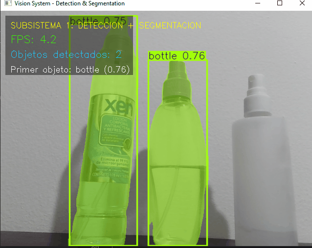
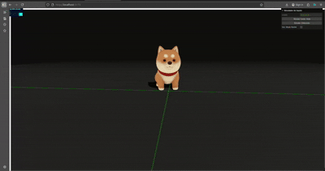
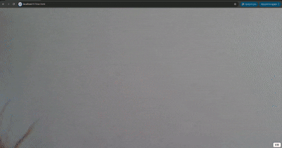

# Taller 4 — Taller Integral de Computación Visual Avanzada

## Fecha

`2025-12-03`

# Subsistema 1: Visualización 3D Optimizada y Realidad Aumentada

## Descripción del Proyecto

Este subsistema constituye el módulo encargado de la **percepción visual** dentro del proyecto de Computación Visual Avanzada. Su función es capturar video en tiempo real y ejecutar:

1. **Detección de objetos** mediante YOLOv8/YOLOv9.  
2. **Segmentación de instancias** utilizando modelos "-seg".  
3. **Representación visual estilizada** mediante un HUD moderno.  
4. **Exportación estructurada** en formato JSON para consumo de otros subsistemas.

Este módulo funciona de manera **totalmente autónoma**, independiente del resto del pipeline.

---

## Stack Tecnológico

- **Visión por Computador:** Ultralytics YOLO (v8+)
- **Segmentación:** YOLO-Seg (Modelos Nano/Small)
- **Procesamiento de Video:** OpenCV
- **Serialización:** JSON
- **Interfaz HUD:** Overlays con OpenCV
- **Lenguaje:** Python 3.10+

---

## Funcionalidades Clave

### A. Detección en Tiempo Real (YOLO)
El sistema realiza detección de múltiples objetos en la escena:
- Soporte para 80 clases del dataset COCO.
- Visualización con colores consistentes y tipografía limpia.
- Detecciones en tiempo real con webcam.

### B. Segmentación de Instancias (YOLO-Seg)
El sistema puede segmentar objetos:
- Máscaras por instancia.
- Polígonos representados en arrays.
- Exportación a JSON por cada fotograma.

### C. Interfaz Visual Optimizada (HUD)
Interfaz moderna tipo panel lateral:
- FPS en tiempo real.
- Número de objetos detectados.
- Clase y confianza del primer objeto.
- Caja semi–transparente estilo "Cyber HUD".

### D. Exportación de Datos (JSON)
Cada fotograma genera un archivo JSON con:
- Bounding boxes.
- Clase.
- Confianza.
- Máscara segmentada.

Estos archivos pueden ser consumidos por sistemas de visualización o dashboards.
---
## ▶️ Instrucciones de Ejecución

### 1. Prerrequisitos
- Python 3.10 o superior
- Webcam

### 2. Instalar dependencias
```
pip install -r requirements.txt
```

### 3. Ejecutar el subsistema
```
python main.py
```

### 4. Resultados generados
- `results/detections/` — imágenes anotadas
- `results/json/` — detecciones en formato JSON

---

## Métricas de Rendimiento

| Métrica | Valor esperado |
|--------|----------------|
| FPS Promedio | 15–30 FPS |
| Latencia por frame | 30–80 ms |
| Clases detectadas | 80 (COCO) |
| Resolución | 640×480 |

Se recomienda analizar:
- Variación de FPS según resolución.
- Objetos detectados por frame.
- Tiempos de inferencia promedio.

---

## Evidencias

**Fig 1. HUD de detección y segmentación**




---


# Subsistema 3: Visualización 3D Optimizada y Realidad Aumentada
##  Descripción del Proyecto

Este subsistema es el módulo encargado de la **representación visual y experiencial** dentro del proyecto de Computación Visual Avanzada. Su objetivo es recibir datos (simulados o reales) de detección y transformarlos en una experiencia gráfica inmersiva de alto rendimiento.

El sistema implementa dos modalidades de visualización:

1.  **Modo Escena Web (Three.js):** Un entorno 3D "Cyberpunk" optimizado mediante técnicas de Nivel de Detalle (LOD) y sombras dinámicas.
2.  **Modo Realidad Aumentada (AR.js):** Visualización sobre marcadores físicos (Hiro) con lógica de optimización de distancia personalizada.

## Stack Tecnológico

  * **Motor Gráfico:** Three.js (r150+)
  * **Realidad Aumentada:** AR.js + A-Frame
  * **Entorno de Desarrollo:** Vite (Vanilla JS)
  * **Optimización:** GLTFLoader + THREE.LOD
  * **Interfaz de Control:** Lil-gui (Simulación de inputs externos)
  * **Métricas:** Stats.js

## Funcionalidades Clave (Entregables)

### A. Optimización Visual (LOD - Level of Detail)

Implementación de carga dinámica de geometría para mantener **60 FPS** estables.

  * **High Poly (.gltf):** Se carga cuando la cámara está a \< 25 metros. Incluye sombras suaves y materiales complejos.
  * **Low Poly (.glb):** Se carga cuando la cámara está a \> 25 metros. Geometría simplificada al 10% y wireframe de depuración (opcional).

### B. Interacción Simulada (GUI)

Debido a la arquitectura de subsistemas independientes, se implementó un panel de control (`lil-gui`) que simula la recepción de WebSockets del Subsistema 1 (Detección) y 2 (Control):

  * **Simulación de Gesto:** Escala el modelo en tiempo real.
  * **Simulación de Entorno:** Cambia la iluminación (Modo Día/Noche).

### C. Realidad Aumentada (AR Web)

Módulo independiente accesible vía `ar.html`.

  * Detección de marcador **Hiro**.
  * Script personalizado `lod-control` que calcula la distancia euclidiana entre la cámara y el marcador para intercambiar modelos High/Low en tiempo real.

##  Instrucciones de Ejecución

### Prerrequisitos

  * Node.js (v14 o superior)
  * Navegador con soporte WebGL (Chrome/Firefox recomendado)
  * Webcam (para módulo AR)

### Pasos

1.  **Instalar dependencias:**

    ```bash
    cd threejs
    npm install
    ```

2.  **Iniciar servidor de desarrollo:**

    ```bash
    npm run dev
    ```

3.  **Visualizar:**

      * **Escena 3D:** Abrir `http://localhost:5173/`
      * **Realidad Aumentada:** Abrir `http://localhost:5173/ar.html` (Requiere mostrar el marcador Hiro a la cámara).

## Métricas de Rendimiento

  * **FPS Promedio:** 60 FPS (Estables).
  * **Draw Calls:** \< 50 en escena Low Poly.
  * **Tiempo de carga:** \< 2s (Modelos optimizados).

## Evidencias

<p align="center">
  <strong>Fig 1. Respuesta a Eventos Simulados (GUI)</strong>
</p>

<p align="center">
  
</p>

<br> <p align="center">
  <strong>Fig 2. Test de Tracking en Realidad Aumentada</strong>
</p>

<p align="center">
  
</p>
