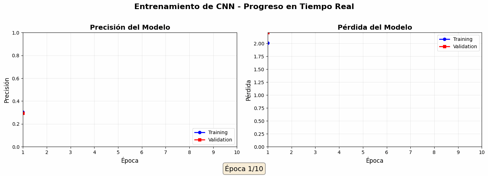
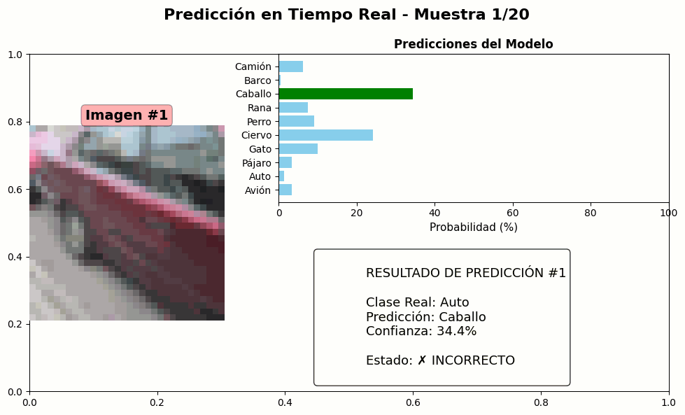
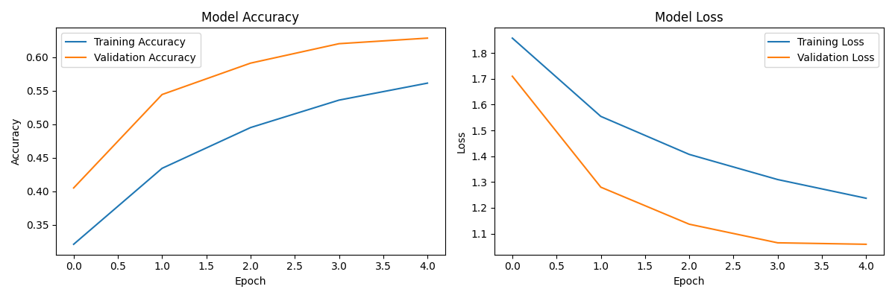
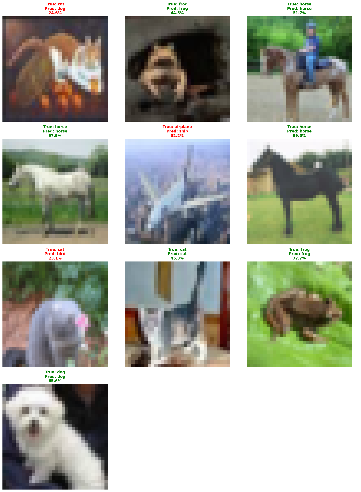

# Visual Evidence - Subsystem 5

**Last Updated:** December 4, 2025
**Subsystem:** 5 - CNN Model Training and Comparison

---

## Evidence Summary

| Type | Count | Location |
| --- | --- | --- |
| Animated GIFs | 2 | evidencias/gifs/ |
| Training Plots | 2 | plots/ |
| Model Files | 1 | modelos/ |
| Metrics | 2 | metrics/ |

---

## Generated GIFs

### 1. Training Progress Animation
**File:** `evidencias/gifs/01_training_progress_20251204_232926.gif`

**Content:**
- Accuracy progression across epochs (training and validation)
- Loss convergence visualization
- Real-time metrics display

**Description:** This animation shows the model's learning process over 5 training epochs. The visualization demonstrates how the accuracy improves and loss decreases as the model learns to classify CIFAR-10 images.



### 2. Model Predictions Visualization
**File:** `evidencias/gifs/02_predictions_20251204_232926.gif`

**Content:**
- Sample images from test set
- Predicted class labels with confidence scores
- Correct predictions (highlighted in green)
- Incorrect predictions (highlighted in red)

**Description:** Interactive visualization showing real-time predictions on test images. Each frame displays the model's classification decision with confidence percentage.



---

## Training Plots

### 1. Training History
**File:** `plots/simple_cnn_history_20251204_202143.png`

**Content:**
- Training and validation accuracy curves
- Training and validation loss curves
- Epoch-by-epoch progression

**Description:** Complete training history showing model performance evolution. The plot reveals the model's learning dynamics and convergence.



### 2. Random Test Samples
**File:** `plots/random_samples_20251204_220401.png`

**Content:**
- Grid of test images
- True labels vs predicted labels
- Confidence scores for predictions

**Description:** Visual comparison showing model predictions on randomly selected test images from all 10 classes.



---

## Model Artifacts

### Trained Model
**File:** `modelos/simple_cnn_20251204_202143.h5`

**Specifications:**
- Format: Keras HDF5
- Size: 611 KB
- Total parameters: 156,522
- Trainable parameters: 156,298
- Non-trainable parameters: 224

---

## Metrics Files

### Latest Metrics JSON
**File:** `metrics/latest_metrics.json`

**Contains:**
- Overall accuracy: 62.79%
- Per-class accuracy breakdown
- Confusion matrix
- Precision, recall, F1-score per class
- ROC AUC score: 0.9365
- Top confusion pairs

### Evidence Manifest
**File:** `metrics/latest_evidence_manifest.json`

**Contains:**
- List of all generated evidence files
- Timestamps and metadata
- File paths and descriptions

---

## Regeneration Instructions

To regenerate all evidence:

```powershell
cd codigo
python run_complete_automation.py
```

This automated pipeline:
1. Verifies or trains the model
2. Runs evaluation on test set
3. Generates GIFs and plots
4. Updates metrics files
5. Updates documentation
6. Packages final deliverables