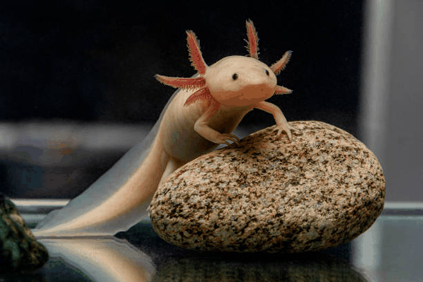
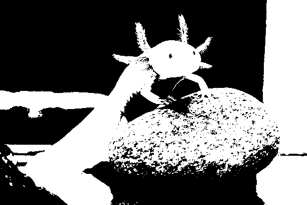
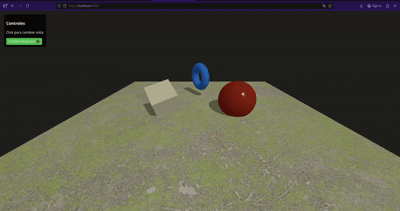

# Examen Final - Computación Gráfica y Multimedia

Este repositorio contiene la solución para el Examen Final, dividido en dos secciones principales: Procesamiento de Imágenes con Python y una Escena 3D interactiva con Three.js.

## Punto 1 – Python

En esta sección se realizó la carga, manipulación y análisis de una imagen digital de un **Ajolote** (*Ambystoma mexicanum*), una especie en vía de extinción. El objetivo fue explorar técnicas fundamentales de visión artificial utilizando librerías como `OpenCV`, `Matplotlib` y `Numpy`.

### Enfoque y Metodología

El flujo de trabajo implementado en el notebook `examen_final_python.ipynb` consistió en:

1.  **Carga y Visualización:** Se cargó la imagen original y se separaron sus canales RGB para analizar la contribución de color en las branquias y cuerpo del ajolote.
2.  **Filtrado:** Se aplicaron filtros de **Suavizado (Gaussian Blur)** para reducir ruido y **Detección de Bordes (Canny/Sobel)** para resaltar la estructura morfológica del animal.
3.  **Operaciones Morfológicas:** Sobre una versión binarizada de la imagen, se aplicaron transformaciones de **Dilatación** y **Erosión**. Estas operaciones permitieron modificar la estructura de los objetos segmentados, rellenando huecos o eliminando ruido visual pequeño respectivamente.
4.  **Animación:** Se generaron secuencias visuales (GIFs) para comparar dinámicamente el antes y el después de cada procesamiento.

### Resultados Visuales

**Comparación de Filtros (Suavizado y Bordes):**
El siguiente GIF muestra la transición entre la imagen original, el efecto de desenfoque y el realce de bordes.


**Comparación de Operaciones Morfológicas:**
Aquí se observa el efecto de las operaciones morfológicas sobre la máscara binaria del ajolote, contrastando la erosión y dilatación.


---

## Punto 2 – Three.js

En esta sección se desarrolló una escena 3D interactiva utilizando la librería **Three.js**. La escena representa una composición geométrica equilibrada con capacidades de animación, texturizado y control de usuario.

### Descripción de la Escena
La composición incluye varias formas geométricas básicas organizadas en el espacio:
* **Formas y Materiales:** Un cubo central con textura realista (metal/madera), una esfera con material brillante que refleja la luz y un torus (dona) decorativo. El suelo utiliza una textura repetitiva para dar contexto espacial.
* **Iluminación:** Se implementó un esquema de iluminación mixto con una **Luz Ambiental** suave para la visibilidad general y una **Luz Direccional** que proyecta sombras dinámicas, realzando la profundidad de los objetos.
* **Animaciones:** Las formas poseen movimiento continuo mediante un bucle de renderizado; el cubo rota sobre sus ejes y la esfera realiza una animación de rebote, demostrando transformaciones en tiempo real.

### Interacción y Controles
El proyecto integra dos niveles de control para el usuario:
1.  **OrbitControls:** Permite explorar la escena libremente (rotar, hacer zoom y desplazar la cámara) utilizando el mouse.
2.  **Cambio de Perspectiva:** Se añadió un botón en la interfaz gráfica (UI) que permite alternar instantáneamente entre la vista de perspectiva estándar y una vista cenital (superior), facilitando la inspección de la distribución de los objetos.

### Visualización
A continuación se muestra la escena en funcionamiento, destacando las animaciones, las texturas y el cambio de cámara:



---

## Instrucciones de Ejecución

Sigue estos pasos para ejecutar los proyectos localmente.

### 1. Ejecución del Notebook (Python)
Asegúrate de tener instalado Python y las siguientes librerías:
```bash
pip install opencv-python matplotlib numpy imageio
````

Para abrir el notebook:

1.  Navega a la carpeta `python/`.
2.  Ejecuta Jupyter Notebook o abre el archivo en VS Code:
    ```bash
    jupyter notebook examen_final_python.ipynb
    ```
3.  Ejecuta las celdas en orden para reproducir el procesamiento y generar los GIFs.

### 2\. Ejecución de la Escena Web (Three.js)

Debido a las políticas de seguridad de los navegadores (CORS) para cargar texturas, es necesario usar un servidor local simple.

1.  Abre una terminal y navega a la carpeta del proyecto:

    ```bash
    cd threejs/
    ```

2.  Inicia un servidor HTTP simple con Python (usa el puerto 8080 para evitar conflictos):

    ```bash
    python3 -m http.server 8080
    ```

3.  Abre tu navegador web e ingresa a la siguiente dirección:

    ```
    http://localhost:8080
    ```
